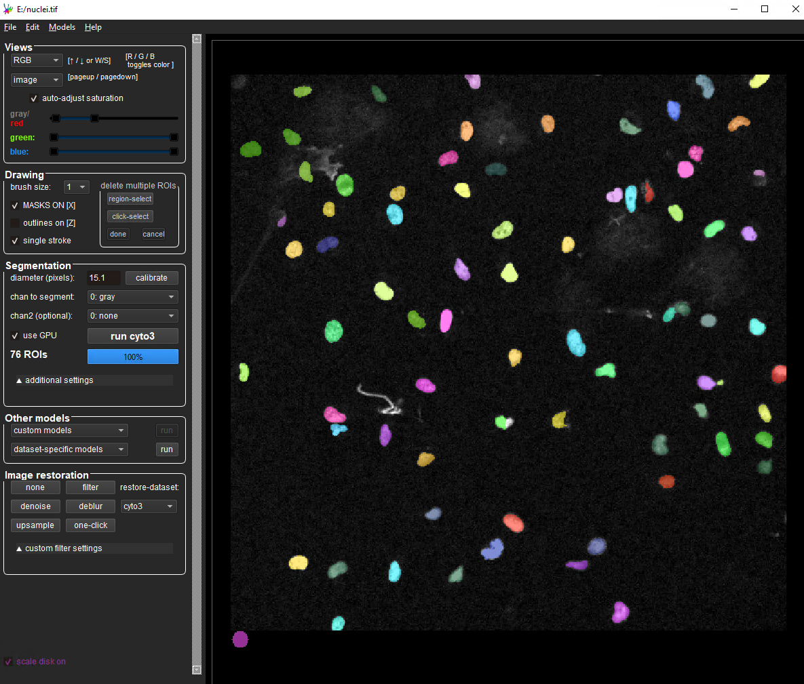

# Cellpose

https://cellpose.readthedocs.io/en/latest/

{.align-center}

install via conda
```
conda create -n cellpose 
conda activate cellpose
pip install cellpose
```

with CUDA GPU:
```
conda create -n cellpose pytorch=1.8.2 cudatoolkit=10.2 -c pytorch-lts
conda activate cellpose
pip install cellpose
```

run gui via command line: ```cellpose```

## Considerations
- 
