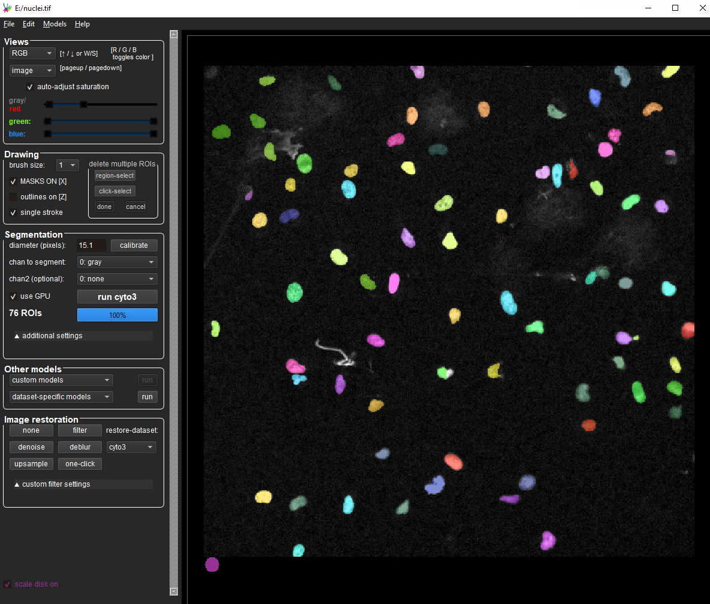

# Cellpose

Generalist deep-learning model for cell, nucleus, and object segmentation in 2D and 3D microscopy images.

## Overview

Cellpose is used via a GUI, Python, or the command line. A Fiji plugin can call a local Cellpose install to bring segmentations into Fiji. The latest version (Cellpose-SAM) generalises to many cell types and modalities without retraining, but custom training on your own data is still supported.

**Key features**

- Pre-trained models including Cellpose-SAM (`cpsam`) for generalist segmentation
- GUI for interactive segmentation, annotation, and human-in-the-loop fine-tuning
- Python API and CLI for batch processing
- GPU acceleration via PyTorch/CUDA
- 2D and 3D segmentation
- Fiji integration via the BIOP wrapper



You can try the latest Cellpose version on one of your own images online at [HuggingFace (Cellpose-SAM)](https://huggingface.co/spaces/mouseland/cellpose).

## Installation

### GUI

The Cellpose GUI runs in Python and provides image loading, segmentation, visualization, and human-in-the-loop model fine-tuning.

- GPU (CUDA) is strongly recommended for reasonable performance.
- Install via the command line using a Python package manager such as `pixi` or `conda`. See [Python environments](conda.md) for setup.

**Recommended: use the ready-made pixi environment.** The [AI_tools_pixi](https://github.com/Leiden-Cell-Observatory/AI_tools_pixi) repository ships a locked Cellpose 4 environment with CUDA 12.8:

```bash
git clone https://github.com/Leiden-Cell-Observatory/AI_tools_pixi
cd AI_tools_pixi/cellpose
pixi install
pixi run cellpose
```

**Alternative: manual conda install.**

```bash
# create a new conda environment
conda create -n cellpose

# activate the new environment
conda activate cellpose

# install cellpose with GUI
pip install cellpose[gui]
```

Launch the GUI with `cellpose`. Activate the environment (`conda activate cellpose`) in each new terminal.

- On a CUDA-capable GPU, `pip` installs the GPU build of PyTorch automatically. Cellpose reports whether the GPU is detected at startup and in the GUI. See the [upstream GPU troubleshooting guide](https://github.com/MouseLand/cellpose#gpu-version-cuda-on-windows-or-linux).
- If installing on your own machine is problematic, use one of the Cell Observatory analysis workstations or an [HPC](../computing/hpc.md) session with remote desktop or X-forwarding.

### Fiji plugin

A Cellpose plugin in Fiji lets you call a local Cellpose install from ImageJ. It needs a working Cellpose environment (see above) and is distributed via the `PTBIOP` Fiji update site.

1. In Fiji, `Help > Update`, click `Manage Update Sites`, enable `PTBIOP`.
2. After restart, the plugin is at `Plugins > BIOP > Cellpose/Omnipose`.
3. Configure it with the path to your Cellpose environment. Find it with `conda env list`.
4. For the latest model, set `--pretrained model` to `cpsam`.

!!! tip
    To convert Cellpose label images to Fiji ROIs, the same update site provides `Plugins > BIOP > Image Analysis > ROIs > Label Image to ROIs`.

- BIOP update site: [https://wiki-biop.epfl.ch/en/ipa/fiji/update-site](https://wiki-biop.epfl.ch/en/ipa/fiji/update-site)
- Plugin source: [https://github.com/BIOP/ijl-utilities-wrappers](https://github.com/BIOP/ijl-utilities-wrappers)

### Command line

For batch processing (e.g. a folder of images), use the same install as the GUI. See the [Cellpose CLI documentation](https://cellpose.readthedocs.io/en/latest/command.html#command-line-examples).

### Running Cellpose on the HPC

To run the Cellpose GUI with a GPU, you can use the [Alice](https://pubappslu.atlassian.net/wiki/spaces/HPCWIKI/pages/37519361/ALICE) cluster. One approach: set up an RDP remote desktop session to Alice ([instructions](https://pubappslu.atlassian.net/wiki/spaces/HPCWIKI/pages/152731649/Getting+a+remote+desktop+on+ALICE+with+RDP#Connecting-from-Windows); MobaXterm simplifies the connection), then run Cellpose inside a Singularity/Apptainer container.

From a terminal on Alice:

```
# create a folder for the container image
mkdir ~/data1/containers/cellpose
cd ~/data1/containers/cellpose

# grab an interactive GPU slurm job
salloc -p testing --gres=gpu:1

# register the container repository
apptainer remote add --no-login SylabsCloud cloud.sycloud.io

# pull the image
singularity pull --arch amd64 library://ez82/cellpose/4.0.6:latest
```

Start the container and launch the GUI:

```
singularity run --nv 4.0.6_latest.sif
cellpose
```

On subsequent sessions, allocate a Slurm job and run the existing `.sif` directly.

## Official documentation

- [Cellpose documentation](https://cellpose.readthedocs.io/en/latest/)
- [Cellpose GitHub](https://github.com/MouseLand/cellpose)

## Learning resources

### Written

- [GUI guide](https://cellpose.readthedocs.io/en/latest/gui.html)
- [Command line usage](https://cellpose.readthedocs.io/en/latest/command.html)
- [Training custom models](https://cellpose.readthedocs.io/en/latest/train.html)
- [Cellpose tag on Image.sc](https://forum.image.sc/tag/cellpose)
