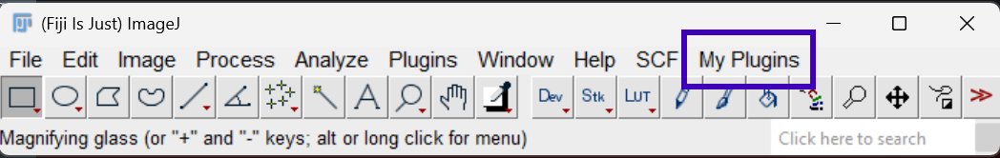

# Github

## Working with Git(hub)

Git is a version control system that allows you to keep track of changes in your code. It is especially useful when working in a team, but also when working alone it can be very helpful to keep track of changes you made to your code.

Do you want to learn all the details on Git: https://git-scm.com/book/en/v2

GitHub is a online platform that allows you to store your git repositories online. It is a great way to share your code with others, and to collaborate on code with others. It is possible to create private repositories that are only visible to you and the people you invite. Later when you are ready you can make your repository public.

Useful tools:
- Github Desktop
	Although git can be used from the command line a visual overview of your repositories on your computer can be very helpful to keep overview of your repositories, local changes that are not yet committed to github.
- VS code
  - Visual Studio Code is a code editor that can be used with a wide variety of programming languages. It has many useful extensions, including a git extension that allows you to manage your git repositories from within the editor.

## Managing your Fiji scripts with Github

- Create a folder in you Fiji /scripts folder e.g. 'My-Scripts"
- This folder will show up as a separate menu in Fiji
- Create a github repository at github.com e.g. name it "My Fiji scripts"
- Use github desktop or git command line ...

{.align-center}

## Cell Observatory Github
The Cell Observatory has its own 
github.com/Leiden-Cell-Observatory

