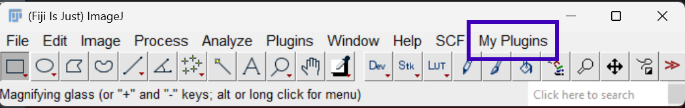

# Git and GitHub

Version control for analysis scripts, Fiji macros, notebooks, and pipelines — track changes, collaborate, and recover from mistakes.

## Overview

**Git** is a version control system that records every change you make to a set of files. You can see who changed what and when, compare versions, undo changes, and work on multiple variants of the same analysis in parallel (branches) without breaking the working version.

**GitHub** is an online host for Git repositories. It adds a web interface, issue tracking, and collaboration features on top of Git. Repositories can be private, shared with specific people, or fully public.

Use Git for anything you would otherwise rename `script_final_v3_REAL.py`: Fiji macros, Jupyter notebooks, CellProfiler pipelines, ilastik projects, analysis scripts, manuscript figures' code. Don't use it for raw image data — that belongs in [OMERO](../omero/index.md).

## Installing Git

- **Windows**: install [Git for Windows](https://git-scm.com/download/win), which provides `git` on the command line and the Git Bash terminal.
- **macOS**: `git` comes with the Xcode command-line tools; run `xcode-select --install` in Terminal.
- **Linux**: install via your package manager (e.g. `sudo apt install git`, `sudo dnf install git`).

You'll also want one of these GUIs — they handle most day-to-day work without touching the command line:

- [**GitHub Desktop**](https://desktop.github.com/) — the simplest option. Good for clone/commit/push/pull with a visual diff.
- [**VS Code**](https://code.visualstudio.com/) — a source editor with built-in Git support. Convenient when you're already editing the code there.

## Core workflow

The minimal mental model, enough to be productive:

1. **Clone** a repository from GitHub to your computer (once per project).
2. **Edit** files locally.
3. **Stage** the changes you want to save (`git add` or tick boxes in the GUI).
4. **Commit** them with a short message describing *why* you made the change.
5. **Push** your commits to GitHub so others (and future-you) can see them.
6. **Pull** to fetch changes others have pushed.

On GitHub itself you can create issues, review changes via pull requests, and — for public repositories — cite a specific version using releases/DOIs via Zenodo.

!!! tip
    Commit often and write meaningful messages. "fixed stuff" in three months is useless. "fix off-by-one in track length filter" tells future-you what happened.

## Managing your Fiji scripts with Git

A common pattern for keeping Fiji macros under version control:

1. Create a folder inside your Fiji `scripts/` folder (e.g. `scripts/My-Scripts/`). Fiji picks this up automatically and adds a top-level menu for its contents.
2. Create a repository on GitHub (e.g. `my-fiji-scripts`).
3. Clone the repo into that folder — or initialize Git inside the existing folder and push it to the new repo.
4. Use GitHub Desktop or the command line to commit and push changes as you refine scripts.

{.align-center}

This way the scripts live inside Fiji (ready to run) and are version-controlled and shareable.

## Cell Observatory on GitHub

Our organisation page: [**github.com/Leiden-Cell-Observatory**](https://github.com/Leiden-Cell-Observatory). It hosts shared Fiji macros, pipeline templates, pixi environments ([AI_tools_pixi](https://github.com/Leiden-Cell-Observatory/AI_tools_pixi)), and this wiki's source. Members can be added to the org — ask to get push access to shared repos.

## Official documentation

- [Git website](https://git-scm.com/)
- [GitHub Docs](https://docs.github.com/)

## Learning resources

### Written

- [Pro Git book](https://git-scm.com/book/en/v2) — the canonical, free Git reference. Chapters 1–3 cover everything most people need.
- [GitHub Skills](https://skills.github.com/) — short interactive tutorials run as issues in your own repo.
- [Software Carpentry: Version Control with Git](https://swcarpentry.github.io/git-novice/) — lesson aimed at researchers, focuses on the workflow rather than exhaustive commands.
