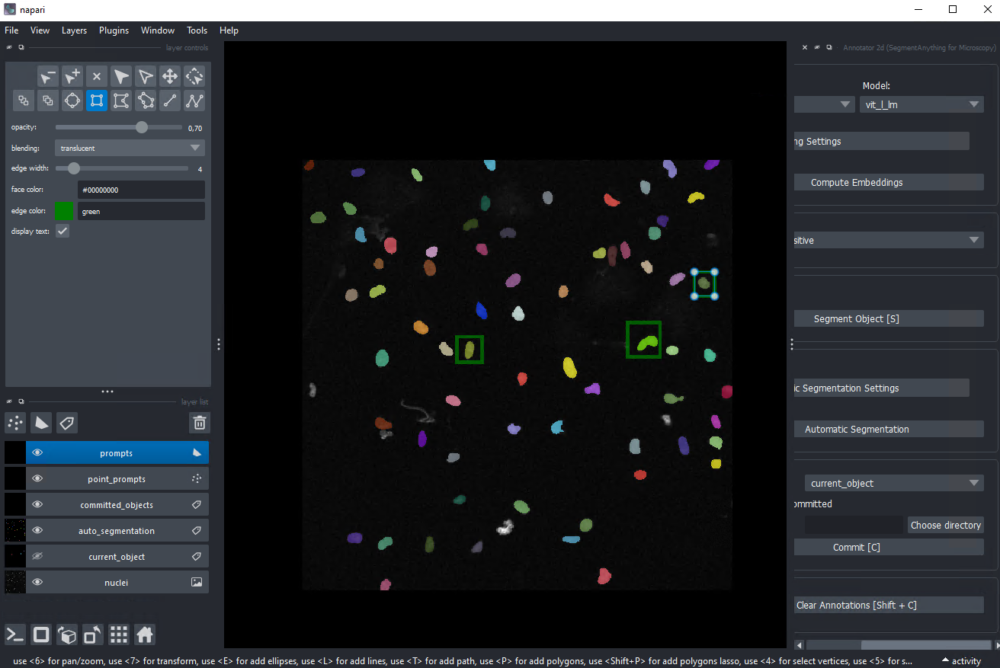

# Segmentation with micro-sam

Segment Anything for Microscopy or [micro-sam](https://computational-cell-analytics.github.io/micro-sam/micro_sam.html)
is a tool to enable automatic and interactive segmentation of microscopy data. It is based on Segment Anything from [Meta](https://segment-anything.com/)

In order to use the micro-sam toolkit it is recommended to use a computer with a decent GPU.

micro-sam can be use to interactively segment images (2D, 3D, time series) in napari. It can also be used to fine-tune the Segment Anything model to allow for automatic instance segmentation of your images.



## Installation
It is advised to install micro-sam in a conda environment. Check [here](conda.md) to install conda.

```bash
conda env create --file environment.yml -n micro-sam
conda install -c conda-forge micro_sam
```

To open the micro-sam plugins:

```bash
napari
```

## finetuning a model for automatic segmentation 
