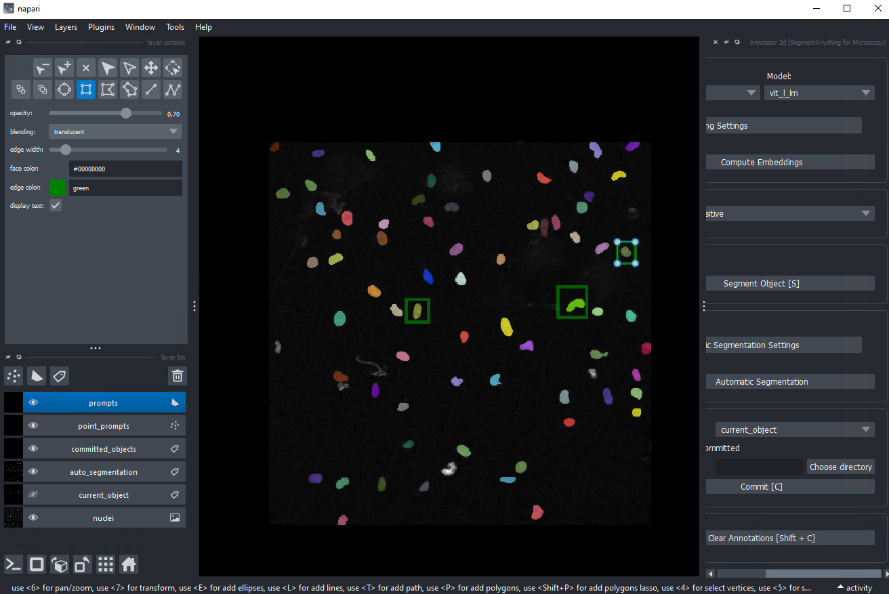

# micro-sam

Segment Anything for microscopy — interactive and automatic segmentation built on Meta's [Segment Anything](https://segment-anything.com/) model.

## Overview

micro-sam adapts the Segment Anything foundation model to microscopy data with finetuned models. It cna run as a napari plugin for interactive segmentation of 2D, 3D, and time-series images, and also supports fine-tuning SAM on your own data for fully automatic instance segmentation. A recent GPU is strongly recommended.



**Key features**

- Interactive point/box prompts for segmentation in napari
- Works on 2D, 3D volumes, and time-series
- Automatic instance segmentation after fine-tuning
- Pre-trained models specialised for light microscopy and electron microscopy

## Installation

See [Python environments](conda.md) for package manager setup (pixi or conda).

**Recommended: use the ready-made pixi environment.** The [AI_tools_pixi](https://github.com/Leiden-Cell-Observatory/AI_tools_pixi) repository ships a locked micro-sam environment with napari, trackastra, and napari-omero (CUDA 12.8):

```bash
git clone https://github.com/Leiden-Cell-Observatory/AI_tools_pixi
cd AI_tools_pixi/micro_sam
pixi install
pixi run napari
```

The micro-sam plugins appear under the napari `Plugins` menu.

**Alternative: manual conda install.**

```bash
conda install -c conda-forge micro_sam
napari
```

!!! tip
    A CUDA-capable GPU makes interactive segmentation feel responsive; CPU-only is usable but slow, particularly on 3D data.

## Official documentation

- [micro-sam documentation](https://computational-cell-analytics.github.io/micro-sam/micro_sam.html)
- [GitHub](https://github.com/computational-cell-analytics/micro-sam)

## Learning resources

### Written

- [Annotation tools guide](https://computational-cell-analytics.github.io/micro-sam/micro_sam.html#annotation-tools) — the napari-based interactive workflow.
- [Fine-tuning guide](https://computational-cell-analytics.github.io/micro-sam/micro_sam.html#training-your-own-model) — train SAM on your own data for automatic segmentation.
