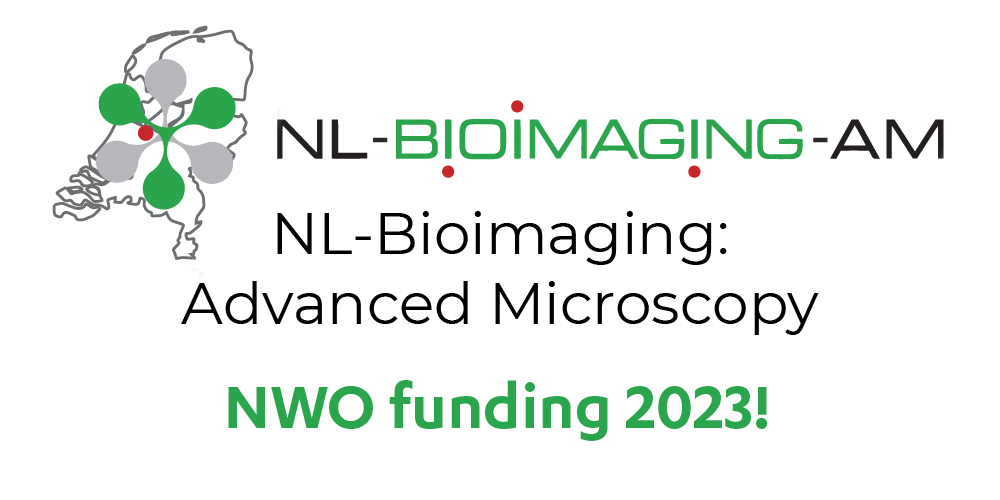
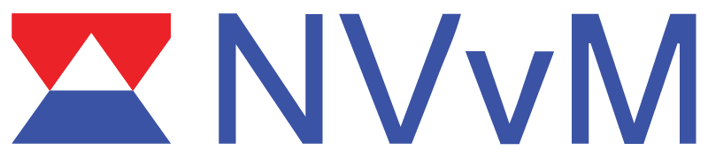
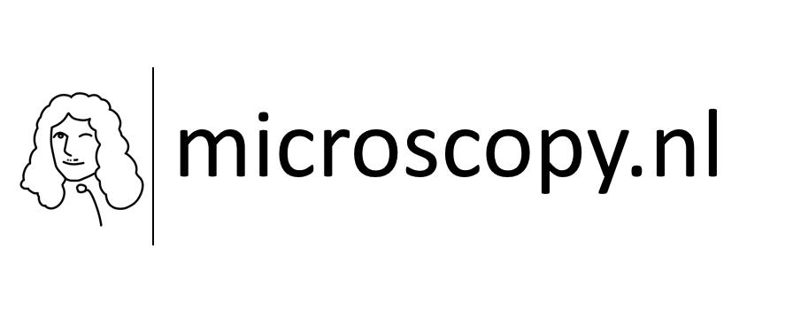
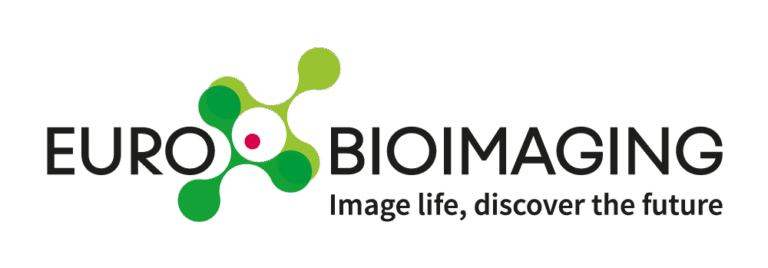

## Facility Managers

-     
**Sylvia Le Dévédec (LACDR) - [Profile](https://www.universiteitleiden.nl/en/staffmembers/sylvia-le-devedec#tab-1){:target="_blank"}**   
[s.e.ledevedec@lacdr.leidenuniv.nl](mailto:s.e.ledevedec@lacdr.leidenuniv.nl)

-     
**Joost Willemse (IBL) - [Profile](https://www.universiteitleiden.nl/en/staffmembers/joost-willemse#tab-1){:target="_blank"}**  
[jwillemse@biology.leidenuniv.nl](mailto:jwillemse@biology.leidenuniv.nl)

-    
**Amit Cherian (LIC) - [Profile](https://www.universiteitleiden.nl/en/staffmembers/amit-cherian#tab-1){:target="_blank"}**  
[a.cherian@lic.leidenuniv.nl](mailto:a.cherian@lic.leidenuniv.nl)

## Operators

-    
**Bas Laan (IBL) - [Profile](https://www.universiteitleiden.nl/en/staffmembers/bas-laan#tab-1){:target="_blank"}**  
[s.n.j.laan@biology.leidenuniv.nl](mailto:s.n.j.laan@biology.leidenuniv.nl)

-       
**Kostas Tassis (LACDR) - [Profile](https://www.universiteitleiden.nl/en/staffmembers/kostas-tassis#tab-1){:target="_blank"}**  
[k.tassis@lacdr.leidenuniv.nl](mailto:k.tassis@lacdr.leidenuniv.nl)

## OMERO/Image Analysis support

-    
**Maarten Paul - [Profile](https://www.universiteitleiden.nl/en/staffmembers/maarten-paul#tab-1){:target="_blank"}**  
[m.w.paul@lacdr.leidenuniv.nl](mailto:m.w.paul@lacdr.leidenuniv.nl)    
[m.w.paul@lumc.nl](mailto:m.w.paul@lumc.nl)

## More info

For general questions, feel free to reach out to the appropriate contact listed above.    
For more information visit the [Leiden Cell Observatory - Our People](https://www.universiteitleiden.nl/en/science/cell-observatory/our-people#facility-managers,leiden-fair-cell-observatory,operators,cell-observatory-board){:target="_blank"} page.

## Other organizations
We are part of the Dutch and European microscopy infrastructure:   

-     
   [:octicons-arrow-right-24: NL-BioImaging](https://eurobioimaging.nl/){:target="_blank"}
- {: style="height:60px"}    
  {: style="height:120px"}    
   [:octicons-arrow-right-24: Microscopy.nl](https://microscopie.nl/){:target="_blank"}
-     
   [:octicons-arrow-right-24: Euro-BioImaging](https://www.eurobioimaging.eu/){:target="_blank"}

