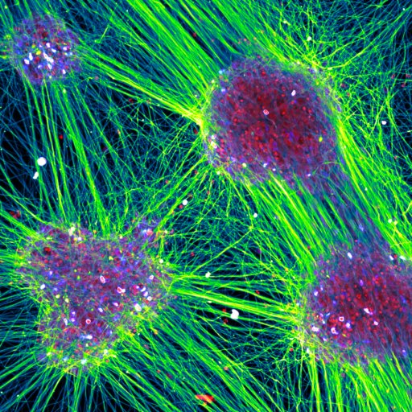
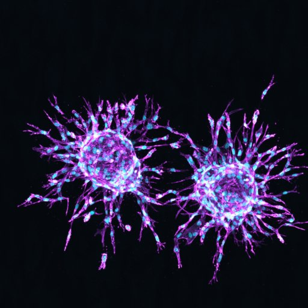
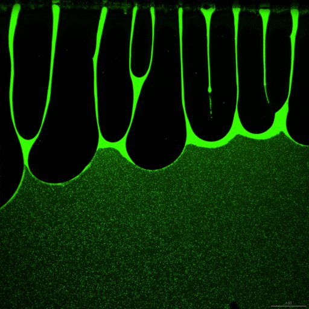
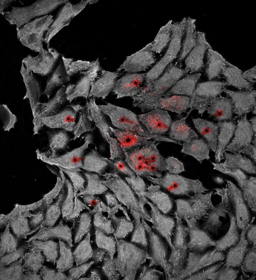
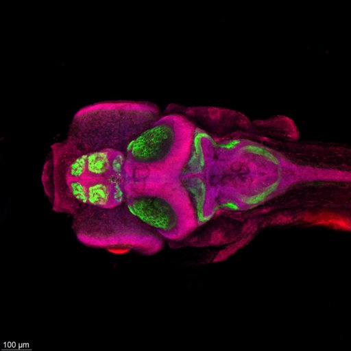

---
hide:
  - toc
title: Results 2025
---

# Leiden Cell Observatory Photomicrograph Competition

## 2025 Winners

-   

    **1st prize – Max Fernkorn (LACDR)**

    *Everything is connected*

    This image shows human stem cell–derived neurons self-organizing into large colonies of cell bodies, interconnected by a striking mesh of neurites. The visualization represents an immunostaining for different neuron-specific markers combined with nuclear staining, displayed as a z-stack acquired with a confocal microscope within LCO at low (20×) magnification. 

    **Microscope:** Nikon confocal

-   

    **2nd prize – Alex Versluis (IBL)**

    *The touch of creation*

    Sprouting of endothelial cells (HUVECs) in fibrin matrix.

    **Microscope:** Leica Stellaris 5

-   

    **3rd prize – David Norte (IBL)**

    *Sticky Fingers*
    
    *Streptomyces venezuelae* modified to express either mCherry or GFP. Fluorescence channel obtained from NIKON AX confocal camera. In Sticky Fingers, millions of free-flowing Streptomyces spores became concentrated in slowly collapsing "fingers" near the slide edge. This effect is caused by "viscous fingering", the solution is being displaced by air and resisting with its surface tension. As the fingers recede, the spores concentration increases, increasing the fluorescent signal inside the fingers. 

    **Microscope:** Nikon AX Confocal

-   

    **4th prize – Don Schilder (LIC)**

    *Wounds of Light*

    **Microscope:** Leica Stellaris (NKI)

-   

    **5th prize – Joaquin Abugattas-Nuñez Del Prado (IBL)**

    *Neural Architecture in Bloom: Visualizing the Zebrafish Brain at 5 Days Post-Fertilization*

    This immunofluorescence image reveals the intricate organization of the zebrafish brain at 5 days post-fertilization. Synaptic vesicles are marked with an antibody against SV2 (magenta), neuronal cell bodies and circuits are highlighted with NeuroTrace (green), and nuclei are counterstained with DAPI (blue). The dorsal and lateral perspectives together illustrate the layered complexity of the developing nervous system.

    **Microscope:** Leica Stellaris 5

---

All images on this page are licensed under a [Creative Commons Attribution-NonCommercial 4.0 International License](https://creativecommons.org/licenses/by-nc/4.0/). Please credit the original author when reusing. For commercial use, contact the author for permission.

