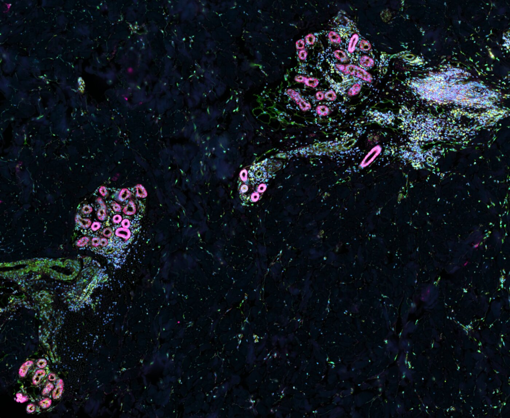
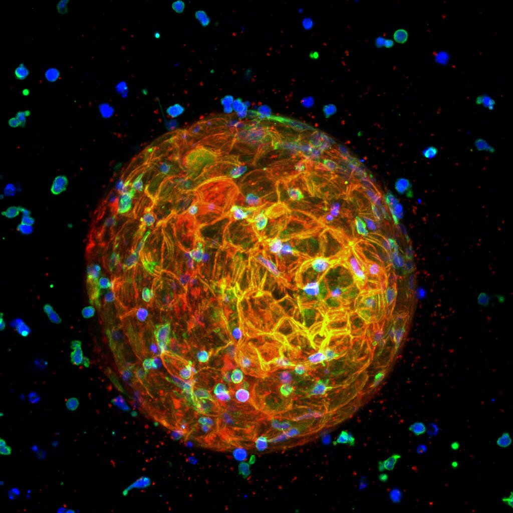
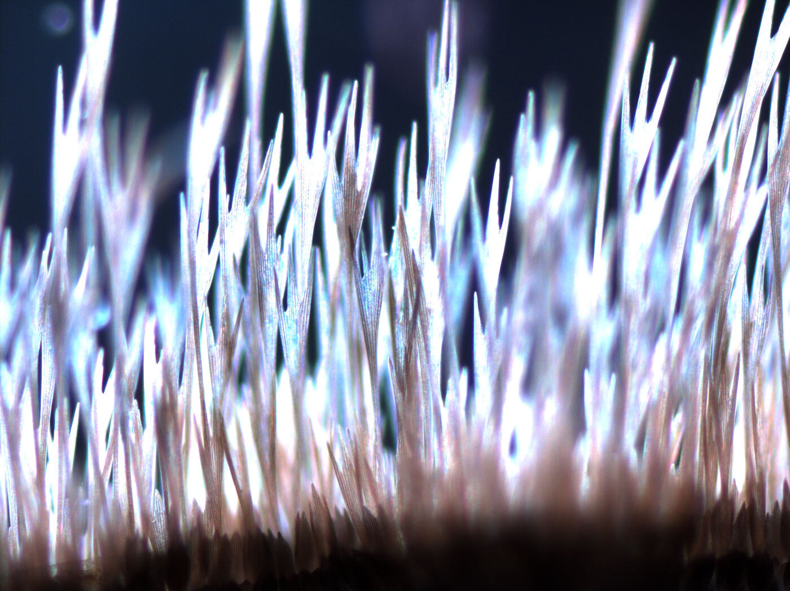
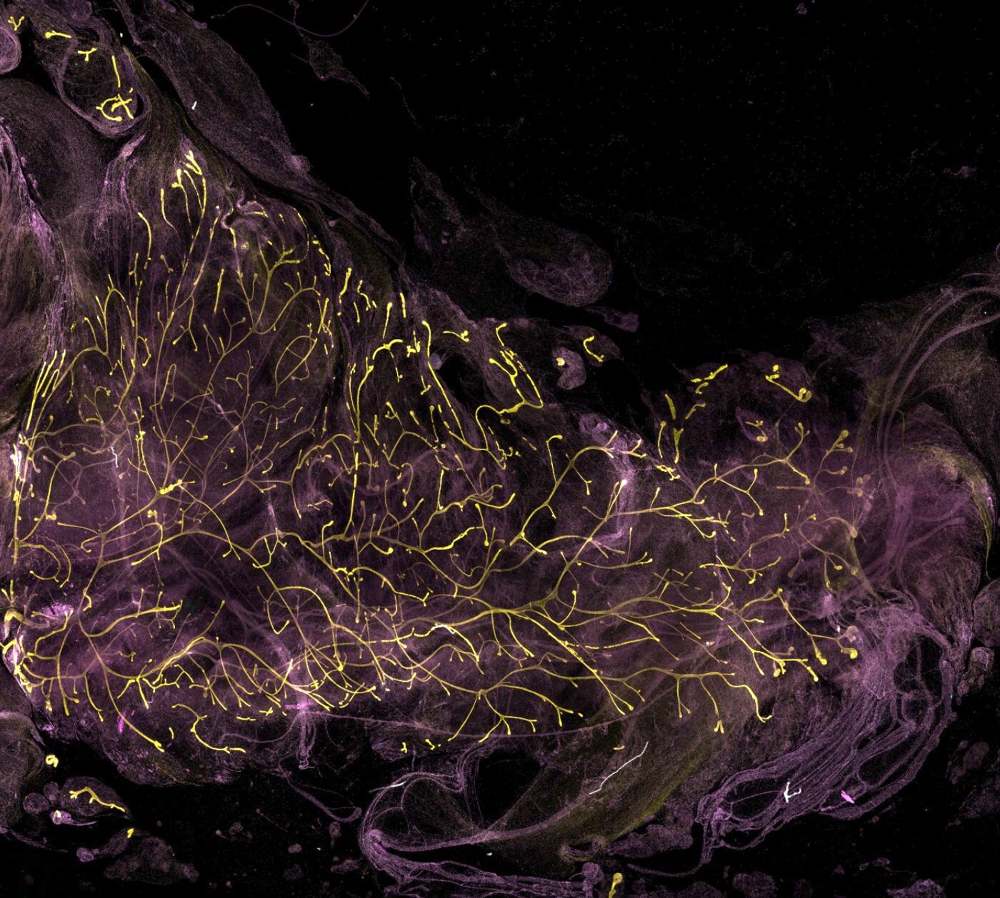
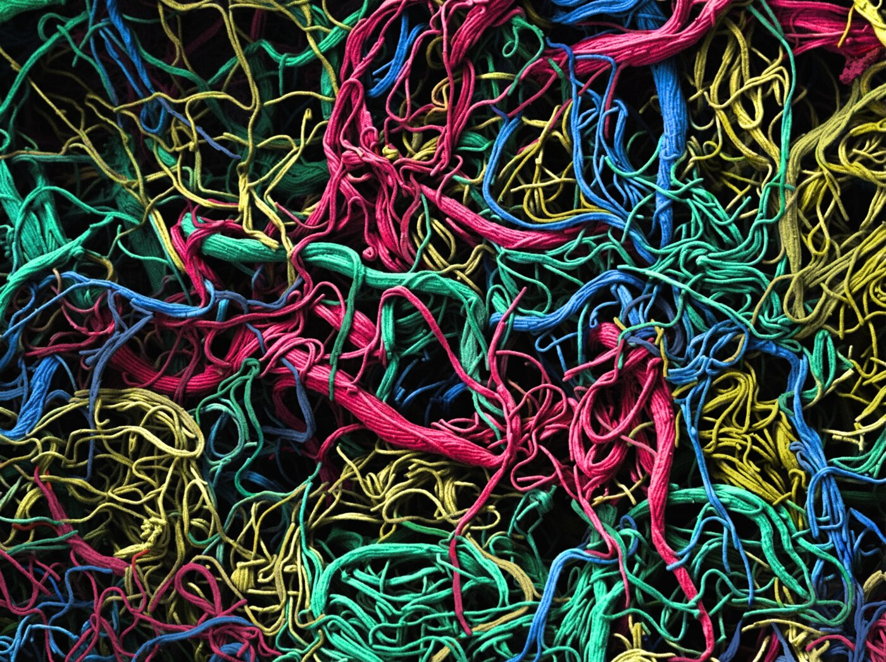
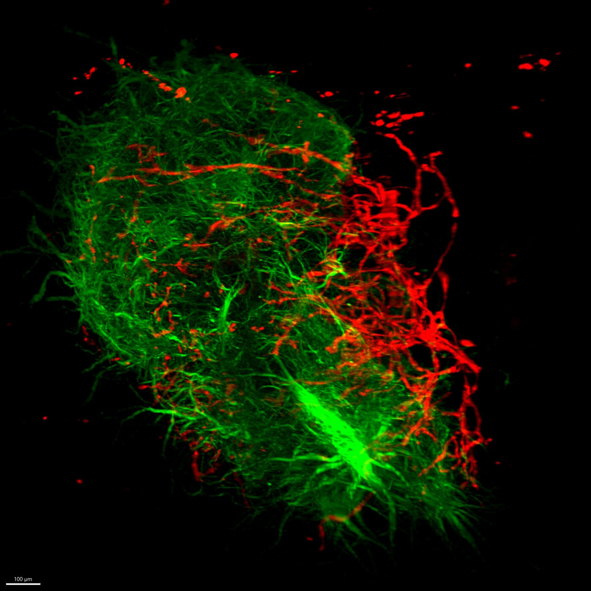
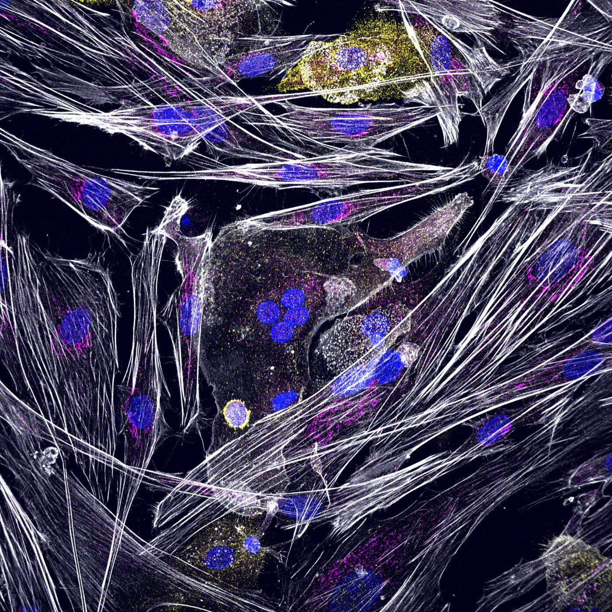
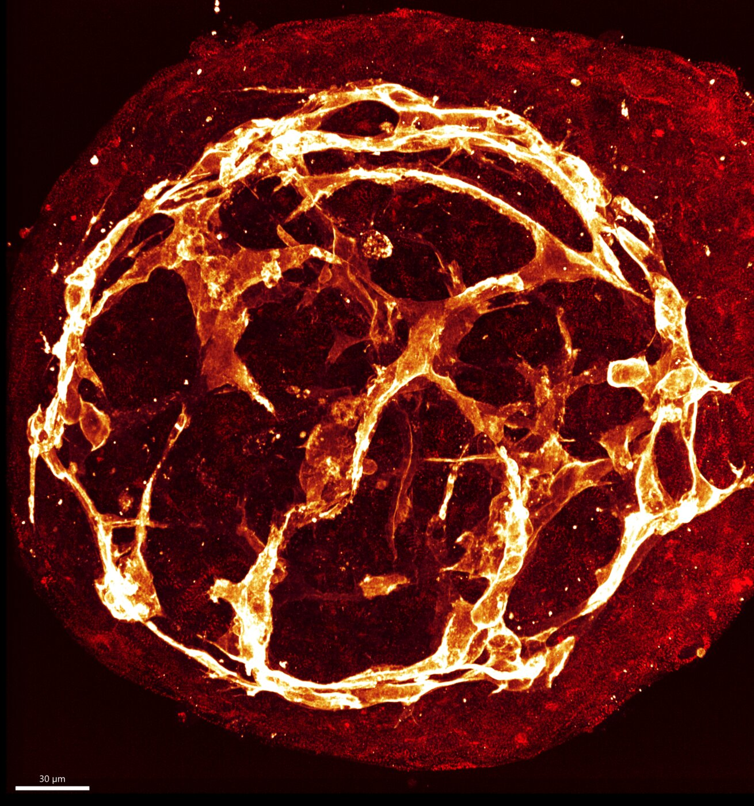
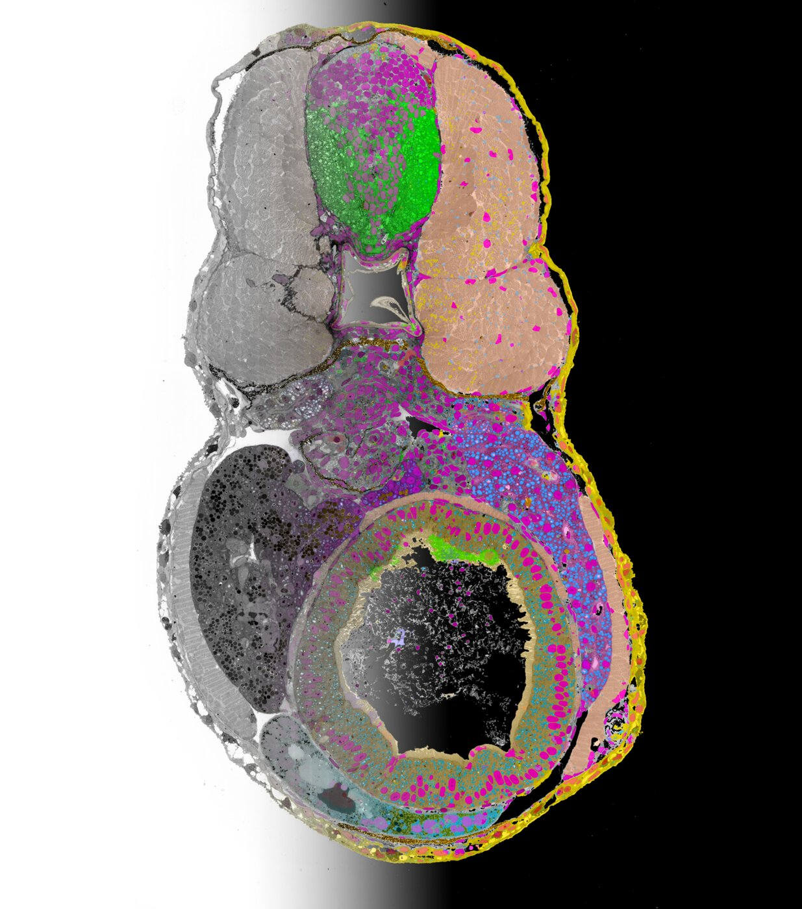
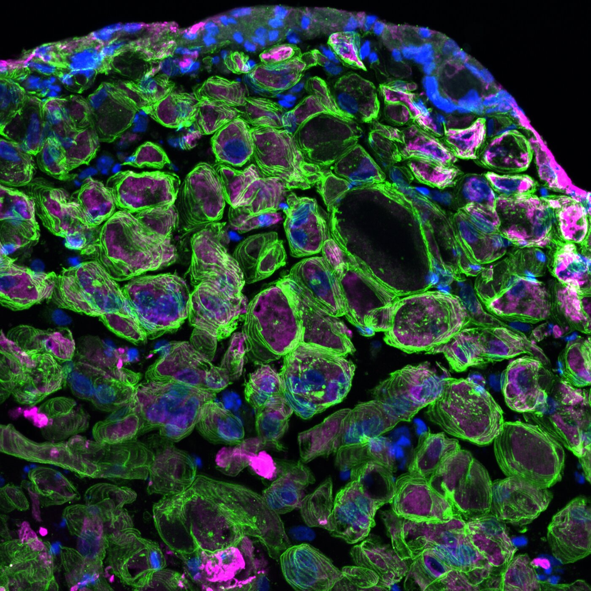

---
hide:
  - toc
title: Results 2026
---

# Van Leeuwenhoek Awards-Leiden Micrograph Contest 2026

The Van Leeuwenhoek Awards celebrate the power of microscopy to reveal the unseen. Named after Antonie van Leeuwenhoek, the “father of microbiology” and one of the first microscopist, the competition highlights the unique ability of imaging technologies to uncover hidden structures, patterns and processes that are fundamental to life and health.

Organized by the Leiden Bio Science Park, Leiden University Medical Center and Leiden University, the competition brings together researchers, innovators and organizations connected to the park to showcase outstanding images and visualizations derived from microscopy data. From classical light and electron microscopy to advanced data-driven renderings, the awards aim to recognize work that combines scientific insight with visual impact.

## 2026 Winners

-   

    **1st prize – Marie Chevalier (LUMC)**

    *The Creation of Sweat*

    What should have been just structure—coils, ducts, cells arranged with quiet biological purpose—started to feel almost intentional. Two sweat glands, curved toward each other across the tissue like hesitant strangers. Not quite touching but close enough to create a tension in the space between them. I tilted my head, adjusted the magnification, and suddenly it clicked: The Creation of Sweat. Unlike Michelangelo's God and Adam, there is no divine spark leaping from gland to gland; no thunderclouds or angels swirling in the background. Here, the drama is quieter. Intimate. The glands themselves are both creator and creation, sculpted not in marble but in the soft architecture of living tissue. Not a moment of grand creation, but of continuous becoming.

    Skin, FFPE, Xenium cell segmentation kit (nuclear (DAPI), interior protein and boundary stain).

    **Microscope:** 10x Genomics Xenium Analyzer

-   

    **2nd prize – Anita Liao (UL)**

    *The Immune Siege*

    A HER2-positive tumoroid embedded in a 3D collagen matrix is attacked by recruited T-cells. T-cell–redirecting bispecific antibodies promote interactions between T-cells and tumor cells, triggering T-cell activation upon target engagement. Activated T-cells (blue) display enhanced F-actin organization (green) and initiate tumor cell killing, while activation-associated chemotactic signaling promotes the continued recruitment of additional T-cells toward the tumoroid. Tumor cell disruption leads to the release of membrane fragments, visible as small red puncta surrounding the tumoroid. This image captures the coordinated immune recruitment and tumor-targeting cascade during T-cell–mediated attack. The image is shown as a maximum-intensity projection of the 3D dataset.

    **Microscope:** Nikon confocal (20× long working distance water-immersion objective)

-   

    **3rd prize – Gerda Lamers (UL)**

    *Into the air*

    Detailed stereomicrograph of butterfly wings (butterfly wing, dead collected).

    **Microscope:** Zeiss V16 (80×)

-   

    **4th place – Roshni Nair (UL)**

    *Human iPSC-Derived Mammary Gland Reconstitution in vivo*

    This image shows the outgrowth of human iPSC-derived breast organoids transplanted into the cleared mammary fat pad of a mouse 10 weeks post transplantation. The fluorescent branching structures represent successful repopulation and organization of the mammary gland by the transplanted cells. I chose to submit this image because it represents an important proof-of-concept in my PhD research. To our knowledge, this has not been achieved before: demonstrating that human iPSC-derived breast cells can regenerate and repopulate the mammary gland in vivo. This system closely mimics a near wild-type mammary environment and provides a powerful new platform to study early breast development and breast cancer initiation in a more physiologically relevant setting. Beyond its scientific importance, the image also captures the striking beauty and complexity of tissue architecture revealed through advanced imaging.

    **Microscope:** Nikon Eclipse Ti2 confocal

-   

    **5th place – David M. Norte (UL)**

    *Leeuwenhoek's Chromatic Threads*

    Here is displayed the filamentous structure of *Streptomyces venezuelae*, forming a dense network reminiscent of a living textile. Each filament contributes to a structured yet adaptive architecture, reflecting how bacterial growth organizes into complex patterns. The visualization is framed in the spirit of Antonie van Leeuwenhoek, whose observations first exposed the hidden complexity of the microscopic world. His work laid the foundation for viewing biology as something deeply interconnected at scales invisible to the naked eye. This picture was painstakingly hand-colored over many hours. Using a vivid palette, the colors are carefully interwoven through the filamentous structure, emphasizing both complexity and continuity. The result is a dense, living tapestry where biological architecture and color merge, highlighting patterns that would otherwise remain hidden.

    **Microscope:** JEOL SEM 7600 (1000×)

-   

    **6th place – Bas Voesenek (LUMC)**

    *Vascularization of a brain organoid*

    The image shows a 3D render of an assembloid (fusion of a mesodermal and neuronal organoid) where neurons (MAP2, green) and endothelial cells (CD31, red) are stained. I think this picture nicely shows how great-quality images of organoids can be obtained with the light-sheet microscope, with an optimized clearing and staining protocol. Also, vascularization of (brain) organoids is one of the most important next steps to improve organoid models, making it important to work on strategies that can do this.

    **Microscope:** Miltenyi UltraMicroscope Blaze light sheet (12×)

-   

    **7th place – Iveta Dzivite & Melanie Breij (LUMC)**

    *Can you spot the animal?*

    A direct co-culture of mature osteoblasts and osteoclasts, grown on a mineralised matrix. The cells can be told apart by the cytoskeleton distribution (white), where osteoblasts are more rectangular and straight in shape, and osteoclasts are more misshapen and round. Cell nuclei can be seen in blue, cell cytoskeleton is depicted in white, mature osteoblast marker (osteocalcin) in pink and specific osteoclast marker (CTR) in yellow. This picture was chosen for submission because it depicts the slight chaos of the co-culture very well, and there is something hidden in the middle of the picture, raising discussions of what familiar animal(s) that might represent. Stained by immunofluorescence with DAPI (blue), phalloidin (white), CTR (yellow) and osteocalcin (pink).

    **Microscope:** Andor Dragonfly 500 spinning disc (40×)

-   

    **8th place – Giulia Campostrini (LUMC)**

    *An Inner Fire*

    This light microscopy image shows a miniaturized version of a heart, generated from cells derived from human pluripotent stem cells. These cells have the same DNA of a living individual, allowing us to reproduce their inner fire, with the heart beating units (red) nourished by the vascular network (orange). They represent the glow of both life and scientific discovery. hiPSC-derived cardiac microtissue, fixed, stained with alpha-actinin (red) and CD31 (orange).

    **Microscope:** Andor DragonFly 200 (40×)

-   

    **9th place – Roman Koning (LUMC)**

    *Zebrafish Embryo from TEM to AI*

    Section of 100 nm through a zebrafish embryo, imaged using transmission electron microscopy (left) in which organs and organelles are segmented using machine learning (right). Brain (green), muscle (pink), intestine (green) and skin (yellow) tissues are visible as well as nuclei (magenta) and mitochondria (blue).

    **Microscope:** FEI Tecnai 12 TEM (6500×)

-   

    **10th place – Remko Goossens (LUMC)**

    *Rings of stability*

    The picture shows the edge of a cross section of a 3D-muscle tissue, with sarcoglycan alpha (SGCA) in green, myosin heavy chain in magenta and nuclei in blue. SGCA plays a critical role in stability of myofibers, and in this project we aim to restore its expression in cell lines using CRISPR-Cas9. The maximum intensity projection creates a sense of depth, with the ring-like fibers appearing to extend towards the viewer. Cryosectioned (20 µm) 3D-muscle tissue cultured from primary human muscle cells (myoblasts), fixed and stained with antibodies against SGCA, MYH and counterstained with DAPI. Maximum projection of a Z-stack with 2 µm per slice.

    **Microscope:** Andor Dragonfly 500 (40×)

---

All images on this page are licensed under a [Creative Commons Attribution-NonCommercial 4.0 International License](https://creativecommons.org/licenses/by-nc/4.0/){target="_blank" rel="noopener"}. Please credit the original author when reusing. For commercial use, contact the author for permission.

{target="_blank" rel="noopener"}
