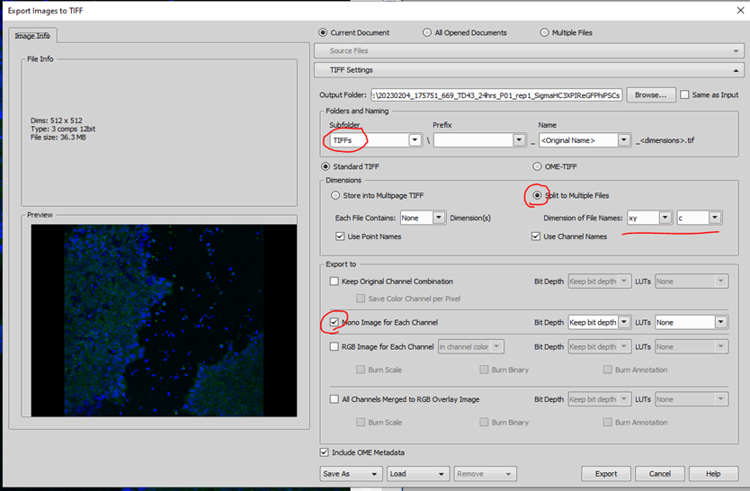
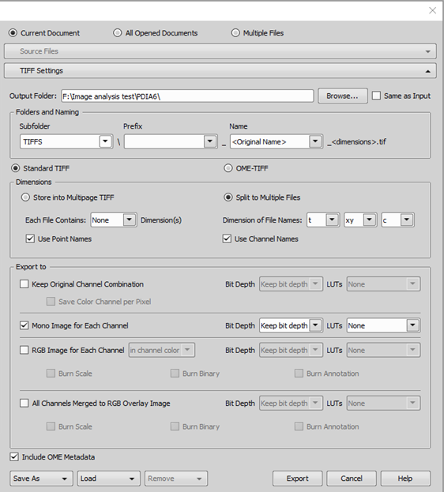
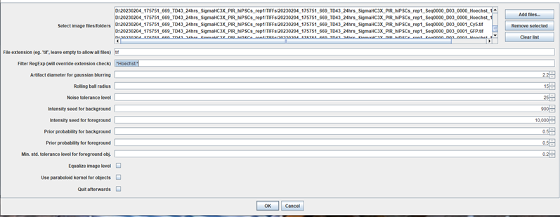
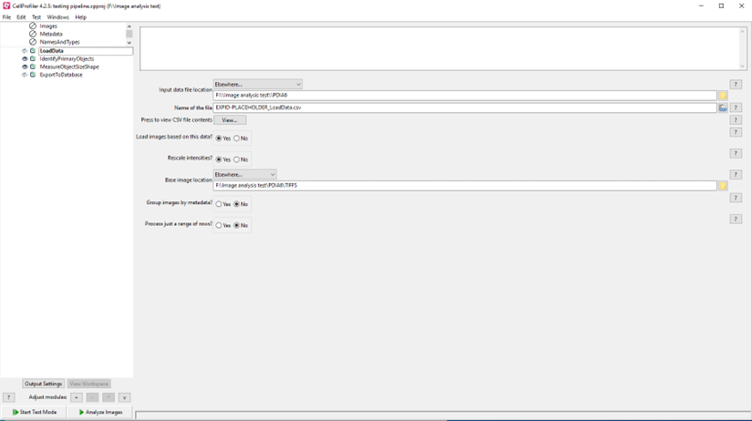
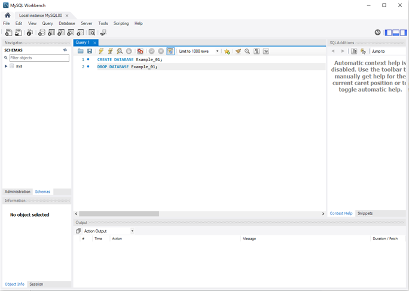
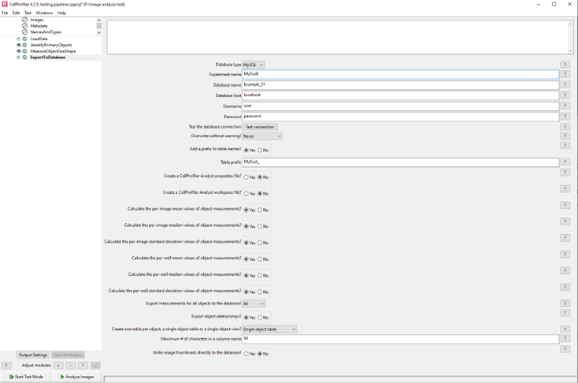

# HCS Image Analysis with CellProfiler

This protocol is based on CellProfiler version 4.2.5 in combination with the WMC (watershed masked clustering) or StarDist plugin in Fiji for segmentation of nuclei.

!!! abstract "Protocol Overview"

    1. Extract images to folder as tiffs with standardised filenames (data\_personalID\_assayID\_plateID)
    2. Generate loadData file using an R script
    3. Start CellProfiler, create LoadData module and import loaddata file (solve errors as they appear, CellProfiler sort of tells you what to do)
    4. Prepare analysis pipeline
    5. Add export to database module
    6. Run pipeline
    7. Extract data from database with an R script
    8. Wrangle data and plot in R

## Before You Begin

!!! info "Requirements"

    === "Software you need"
        Check the ImageAnalysis-Software ([lacdr-tox/ImageAnalysis-Software-WIP](https://github.com/lacdr-tox/ImageAnalysis-Software-WIP)) GitHub repository for software installation instructions.  
        This is currently a private repository. Request access if you do not have it yet.
        
        1. Fiji with StarDist and/or WMC plugins installed
        2. OME.insight - to upload data to OMERO
        3. NIS Elements Viewer - to convert ND2 to TIFFs
        4. CellProfiler (version 4.2.5)
        5. R and RStudio

    === "Files you need"
        1. `ND2` file with your images
        2. MIHCSME file (metadata file) - [Read more here](../omero/importing/mihcsme.md)

## Step 1: Fill Out MIHCSME File

1. Download the example MIHCSME file from the link above.
2. Open the file in Excel or another spreadsheet program.

## Step 2: Preparing the ND2 File and Extracting TIFFs

1. Manually inspect your images of positive and negative controls in the ND2 file.   
2. **Prepare the file structure:**   
   - Create a new folder for your experiment and move the ND2 file into this folder.   
   - Change the ND2 file name to the following format:   

!!! note "File Naming Convention"
    **Format:** `date_personalID_assayID_plateID`
    
    - **date:** from the original folder name   
    - **Personal ID:** three initials   
    - **assayID:** ID given to assay according to ISA standards (see MIHCSME) - three numbers preceded by 'a'   
    - **plateID:** Number of your plate (plate01, plate02, etc. if you have only one plate use plate01)   

    **Example:**
    
    Original name:   
    - Folder name: `20200311_161054_731`   
    - ND2 file name: `Seq0000.nd2`   
    
    New ND2 filename: `20200311_TDA_a002_plate01.nd2`   

3. After you have renamed the file, import the ND2 file into **OMERO** following steps here: [OMERO import instructions](../omero/importing/hcs-data.md). Also attach the MIHCSME file to the `Plate` in OMERO.   

4. **Export ND2 file as TIFFs:**   
    1. Open the ND2 file in NIS Elements Viewer.
    2. Go to File > Save/Export to TIFF Files.
    3. Select the output folder (the same as the input folder or browse the location of the original ND2 file).
    4. Select Subfolder: `<User defined>` TIFFs, Name: `<Original name>`.
    5. Choose Standard TIFF.
    6. Select Split to Multiple Files.
    7. Change dimensions to order `<xy> <t> <c>`.
    8. Use point Names and do not use channel Names. **(example image is wrong)**
    9. Only export to mono image for each channel.
    10. Do not apply LUTs.
    11. Click Export.

Files **without** time points:   
   
Files **with** timepoints: (notice extra dimension)   

## Step 3: Segmentation of Nuclei   

1. Segment nuclei using stardist macro in Fiji
2. Open Fiji
3. Open one Hoechst image in Fiji. (a TIFF of channel `C1`. Drag into Fiji window)
4. Go to `Plugins > stardist > stardist 2D`.
5. Run once. (check `normalize` box)
6. Change settings if needed.
7. Repeat step 2 and 4 until you are satisfied with the segmentation of the nuclei.
8. Save the settings.

9. Click Cancel and close the currently opened image.   
10. Click `Plugins - Macros - Edit` and navigate to and open `stardist_Batch.ijm` - click `Run`   
11. Drag the folder containing images into `Select Image Files Folders`. Select Hoechst images and correct settings.    
    Hoechst is usually the first channel (C1), so for `filter by regExp` write: `.*C1.tif.*` (look up regular expression if you would like to know what this means exactly)

!!! info "File Selection"
    This selects for all files containing `C1.tif` which will be your Hoechst images.
    
    (if C1 is not at the end of your filename, you used a different order of dimensions in step 4.g.  
    You can fix this by extracting your images again with the correct order of dimensions or by writing another regExp here and by changing the regExp in the loaddata script in step 4.e)

12. Check if your folder now contains segmented images.   

## Step 4: Create LoadData File Using In-House R Script   

After steps 2 and 3, you should have a folder named TIFFs containing all `.tif` images and `stardist_mask.png` images based on your Hoechst channel `.tifs`.

Using an R script, extract useful data from the filenames and create a metadata file in Excel.   

1. **Create metadata file in Excel** (if MIHCSME file was not already created in Step 1):
    1. Open MIHCSME file (on github)
    2. Fill out as much assay related information as possible in first three sheets.
    3. Fill out assay conditions in sheet 4.
    4. Column names must contain:
        1. Plate
        2. Well
    5. Add columns relevant to your experiment:
        1. Such as `Treatment`
        2. `Dose`
    6. Save file as `.xlsx` file   
   

1. **Launch `Generate_LoadData_file.R`**
    1. Found on the github in folder `R_scripts` 

2. **Fill in variables:**
    1. path.TIFFS = the path to your `TIFFs` folder.  
       (for example C:\Users\You\documents\Experiment1\CellLineX\TIFFs)
    2. path.master = the path to your output folder.  
       Usually the one containing your nd2 file (C:\Users\You\documents\Experiment1\CellLineX\)
    3. Timepoints `Yes` or `No`. does your filename contain timepoint information (as seen in step 4)
    4. Image sets: enable lines with relevant imagetypes. Often:
        1. ObjectsFileName\_mask
        2. Image\_FileName\_image\_hoechst
        3. Image\_FileName\_image\_pi
        4. Image\_FileName\_image\_gfp
    5. Scroll down and enter path to filled out MIHCSME file
    6. Change name of EXPID-PLACEHOLDER to experiment ID
    7. Run whole script
    8. (Fix errors where necessary)

## Step 5: Run CellProfiler Analysis

1. **Pipeline requirements:**
    - LoadData module
    - ExportToDatabase module

2. **Configure LoadData module:**
    1. Refer to file created in step 4 (input file location)
    2. Load images based on his data? **YES**
    3. Refer to TIFFs folder for base image location.

3. Design your own pipeline after LoadData.  
   You can refer to the sop of your colleagues.

4. End pipeline with ExportToDatabase module

5. **Create database:**
    1. Launch mySQL workbench
    2. Create database in query by running command `CREATE DATABASE databaseName;`
    3. (when necessary delete database with `DROP DATABASE databaseName;`)

6. **Connect CellProfiler to database:**
    1. Database type = MySQL
    2. Experiment name = whatever you want
    3. Database name = the name you chose for the database when using `CREATE DATABASE`
    4. Database host = localhost
    5. username = yourname
    6. Password = your password
    7. Test connection.  
       (if connection failed check your previously entered info)
    8. Calculate per image mean, median and standard deviation.

7. Run pipeline

## Step 6: Retrieve Data from MySQL Server

After running CellProfiler, your data is stored in SQL database. The data has to be retrieved and imported into R for wrangling.

1. **Launch `SQL_Get_CP_Data.R`**
    1. Found on the github in folder `R_scripts`

2. Scroll all the way down

3. **Change server data:**
    1. Dbname = `[name of your database]` (determined earlier)
    2. Host = `localhost`
    3. Port = 3306 (probably, check in SQL workbench)
    4. User = your SQL username
    5. Password = `your SQL password`

4. Change path to your experiment folder

5. Change filename to something relevant

6. Run the full script

7. When you have extracted all your data → delete your database using `DROP DATABASE databaseName;` in mySQL workbench

8. Start wrangling your data!

!!! note "Data Extraction"
    You can pull your data from the database at any point during the analysis.  
    It does not have to be finished to do some preliminary checks.
