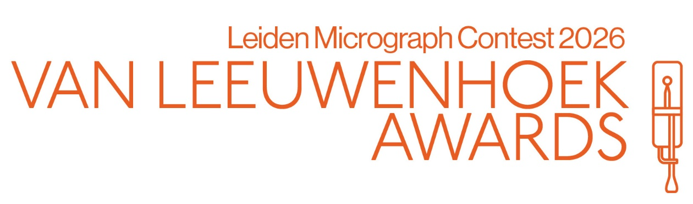
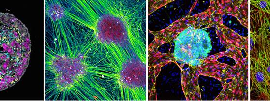

---
hide:
  - toc
---

# Leiden Cell Observatory Wiki

Welcome to the **Leiden Cell Observatory** — the advanced microscopy facility of **Leiden University**.

This wiki provides documentation for the Leiden Cell Observatory's microscopy systems, image analysis workflows, and data management infrastructure using OMERO.

For general facility information, visit our main website: [Leiden Cell Observatory](https://www.universiteitleiden.nl/en/science/cell-observatory){:target="_blank"}

## What you can find here

- **[Microscopes](microscopes/index.md)** — Overview of all microscope at Leiden University and LUMC, usage instructions and booking procedures.

- **[Image Analysis](analysis/index.md)** — Analysis workflows, software tools, best practices for microscopy data.

- **[OMERO](omero/index.md)** — Documentation on our OMERO infrastructure for organizing, storing, and sharing microscopy data.

- **[Publishing & Data Sharing](publishing/index.md)** — Guidance on publishing microscopy data to public repositories, metadata standards, and how to cite the Cell Observatory in your publications.

- **[Resources](resources.md)** — Training materials, software tools, and additional learning resources.
    
    

<h2 style="margin-top: 0;">Submit your photos now to the Van Leeuwenhoek Awards 2026!</h2>

  

    
    
<strong>Submission deadline: 22 May</strong> &nbsp;·&nbsp; <a href="courses/photocompetition2026/">More info</a>

  

  

  Author credits (left-to-right, top-to-bottom): Yolanda Chang (3rd place, LUMC, 2023), Max Fernkorn (1st place, UL, 2025), Maarten van Agen (public choice, LUMC, 2025), Viviana Meraviglia (1st place, LUMC, 2024)

## Getting support

!!! info "Contact us"
    
    Need help selecting the right microscopy system or support with image analysis and data management? 
    
    **Contact the facility staff:** [Contact information](contact.md)
    
    **General enquiries:** [cellobservatory@biology.leidenuniv.nl](mailto:cellobservatory@biology.leidenuniv.nl)
