# IBL Microscopes  
The IBL Microscopy Unit houses, maintains and coordinates most of the microscopy equipment of the IBL. The available equipment ranges from conventional light and fluorescence microscopes, to confocal laser scanning and electron microscopes. In addition, infrastructure is available for histology, including embedding, sectioning and staining. We offer support in automated image analysis for microscopy data. The equipment is housed at two locations: on the 6th floor of the Sylvius building and at the Cell Observatory in the Gorlaeus Laboratory.

**Rules and Regulations**
The Microscopy Unit is open for all students, PhD students, researchers of the IBL as well as guest workers. However, the equipment can only be used after appropriate introduction and/or training. Please contact [Bas Laan](https://www.universiteitleiden.nl/en/staffmembers/bas-laan#tab-1) or [Joost Willemse](https://www.universiteitleiden.nl/en/staffmembers/joost-willemse) for an introduction on the equipment before starting experiments. It is not allowed to use any equipment before being properly trained.

Booking of equipment is done via [Supersaas](https://www.supersaas.com/), for access to the microscopes you need to [register](https://www.supersaas.com/form/CellObservatory/Registration). 

Furthermore if you have questions about experimental set up feel free to walk into our office to discuss which type of microscopy, histology or [image analysis](https://leiden-cell-observatory.github.io/analysis/) you need. If a microscope malfunctions during operation or you are not sure how to use it properly, contact [Bas Laan](https://www.universiteitleiden.nl/en/staffmembers/bas-laan#tab-1) or [Joost Willemse](https://www.universiteitleiden.nl/en/staffmembers/joost-willemse) immediately.

## Confocal Microscopes  

#### Zeiss Airyscan 900  
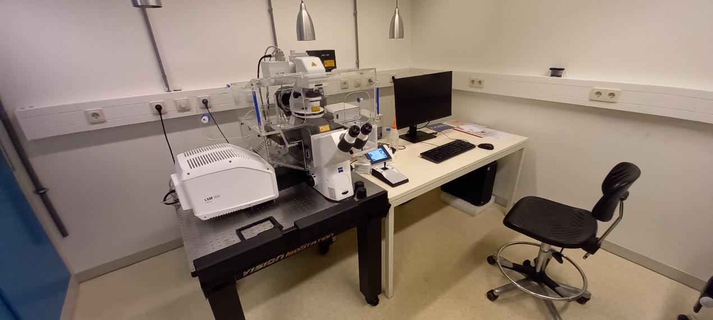  

- **Location**: Sylvius, Rm. 6.5.32  
- **Specifications**:  
    - Inverted confocal laser scanning microscope  
    - Temperature-controlled incubation  
    - Automated stage control  
    - Three fluorescence detector channels  
    - One transmitted light channel  
    - Laser lines: 405, 488, 543, and 633 nm  
- [Book Confocal](https://www.supersaas.com/schedule/IBL_Confocal/Confocals)  
- [View Instructions](https://video.leidenuniv.nl/media/t/1_40bwf016)
- [Bekijk instructies](https://video.leidenuniv.nl/media/t/1_9trqntdm) 

#### Nikon AX  
- **Location**: Sylvius, Rm. 6.5.32  
- **Specifications**:  
    - Upright confocal laser scanning microscope  
    - Two detector channels for fluorescence  
    - One transmitted light channel  
    - Laser lines: 405, 458, 488, 514, 561, and 640 nm  
- [Book Confocal](https://www.supersaas.com/schedule/IBL_Confocal/Confocals)  
- [Bekijk instructies](https://docs.google.com/document/d/1WA_jrRacjnBlvwgtqMIcCbDBZY8Jgb3B/edit?usp=sharing&ouid=111029977919067307805&rtpof=true&sd=true)  

#### Leica TCS SPE  
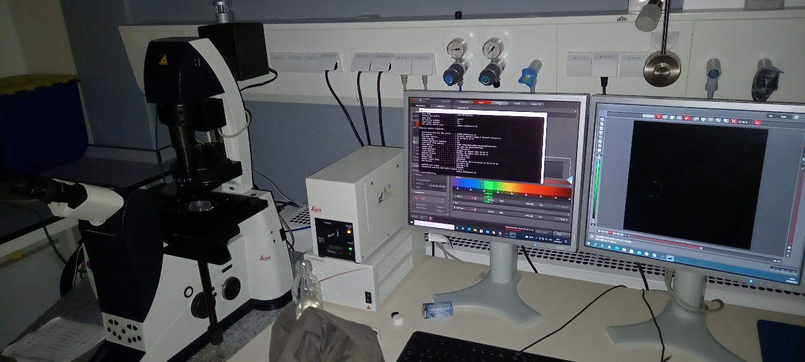  

- **Location**: Cell Observatory GW 2.30a  
- **Specifications**:  
      - Inverted confocal laser scanning microscope  
      - One spectral detector channel for fluorescence  
      - One transmitted light channel  
      - Laser lines: 488, 532, and 633 nm  
- [Book Confocal](https://www.supersaas.com/schedule/IBL_Confocal/Confocals)  
- [Bekijk instructies](https://video.leidenuniv.nl/media/t/1_498i179v)  

#### Leica SP8  
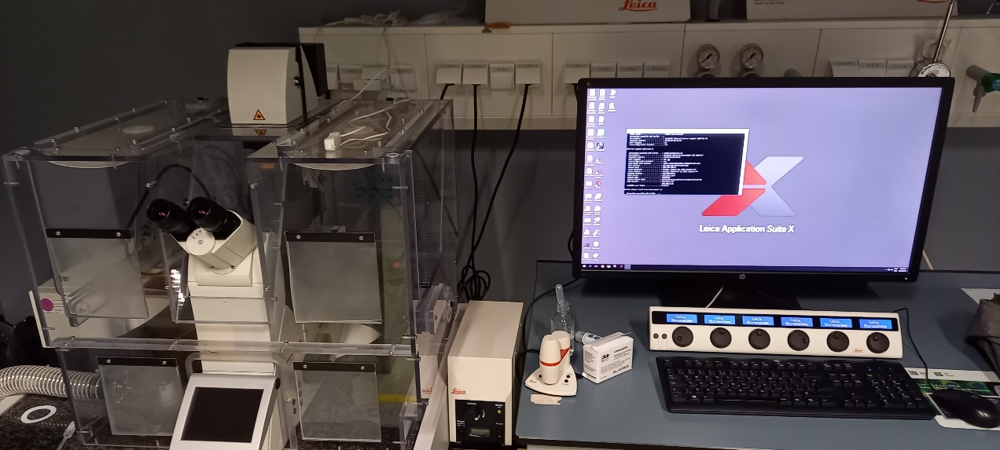  

- **Location**: Cell Observatory GW 2.30a  
- **Specifications**:  
    - Inverted confocal laser scanning microscope  
    - Three spectral detector channels (2 PMT, one GASP)  
    - One transmitted light channel  
    - Laser lines: 405, 488, 532, and 633 nm  
- [Book Confocal](https://www.supersaas.com/schedule/IBL_Confocal/Confocals)  
- [View Instructions](https://video.leidenuniv.nl/media/t/1_0bxcqbo8)
- [Bekijk instructies](https://video.leidenuniv.nl/media/t/1_h0gd81zb)

#### Leica Stellaris 5  
- **Location**: Cell Observatory GW 2.28  
- **Specifications**:  
    - Inverted confocal laser scanning microscope  
    - Three spectral detector channels for fluorescence (all GASPs)  
    - One transmitted light channel  
    - Laser lines: 405, 488, 532, and 633 nm  
- [Book Confocal](https://www.supersaas.com/schedule/IBL_Confocal/Confocals)
- [Bekijk instructies](https://video.leidenuniv.nl/media/t/1_0h9esd33)

## Electron Microscopes  

#### JEOL SEM 7600  
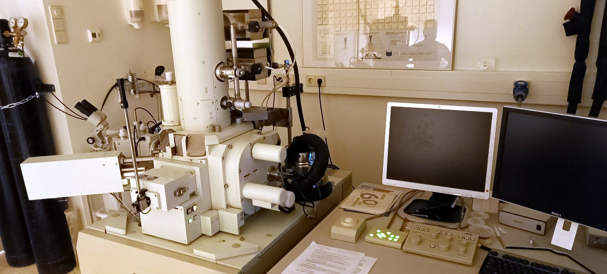  

- **Location**: Sylvius, Rm. 6.5.34  
- **Specifications**:  
    - Conventional high vacuum scanning electron microscope equipped with digital imaging  
    - Cryo-unit for freezing, coating and imaging of samples  
    - EDS for elemental analysis  
- [Book SEM](https://www.supersaas.com/schedule/IBL_SEM/IBL_SEM)  
- [Manual](https://docs.google.com/document/d/1DSRjj7-BcpmJyerdO7XWTOpPW4lkOZGVrT581IkpBqU/edit?usp=sharing)

#### JEOL TEM 1400+  
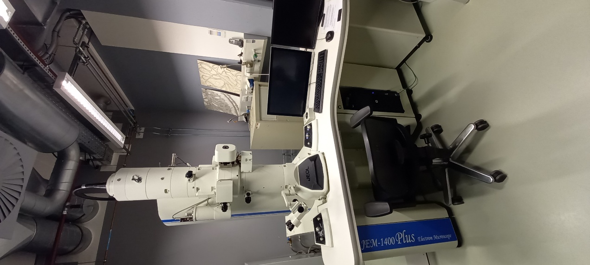  

- **Location**: Cell Observatory GW2.24a  
- **Specifications**:  
    - 120 kV transmission electron microscope  
- [Book TEM](https://www.supersaas.com/schedule/IBL_TEM/TEM)
- [Manual](https://docs.google.com/document/d/1l4E23-00msjVrZE2DB_XtmI4mU4Jmr4EOIJnU0bxxB4/edit?tab=t.0)

## Fluorescence Compound Microscopes  

#### [Zeiss Observer](widefield-observer.md)  
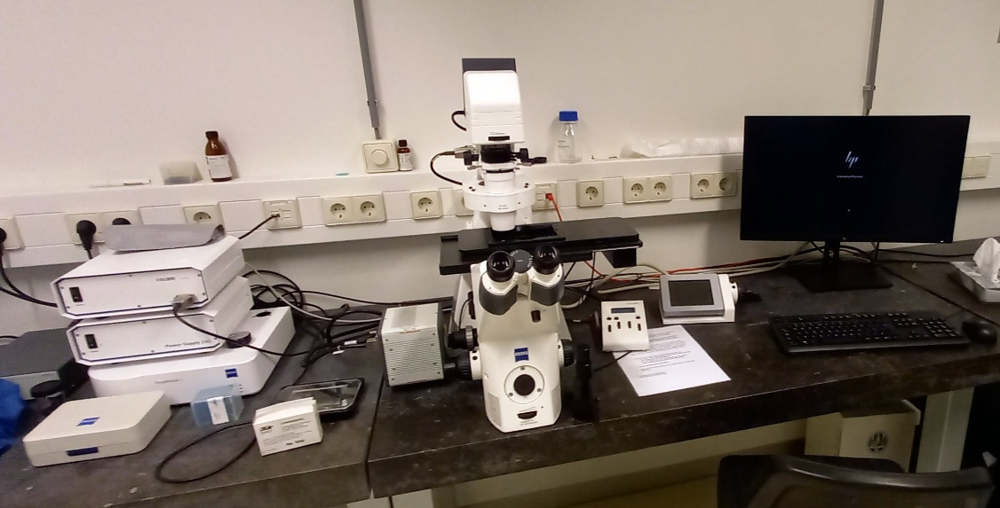  

- **Location**: Sylvius, Rm. 6.5.31a  
- **Features**:  
    - Widefield fluorescence with Colibri system  
    - DAPI, GFP, and mCherry filters  
    - Automated stage  
    - Hamamatsu EMCCD  
    - Multi-well imaging capability  
- [Book Observer](https://www.supersaas.com/schedule/IBL_FluoWide/Observer_widefield)  
- [Imaging Guide](widefield-observer.md)  

#### Zeiss Axioscope A1  
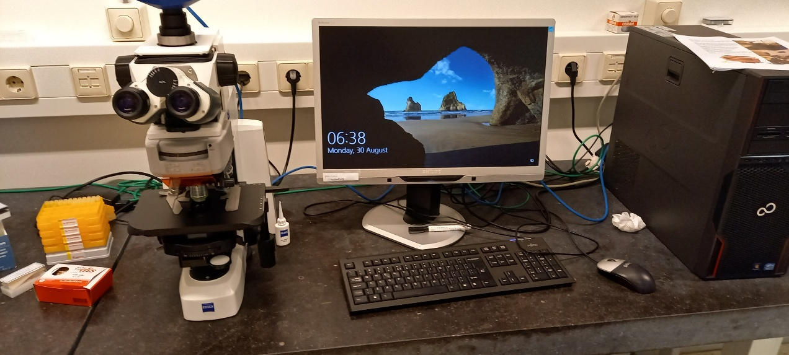  

- **Location**: Sylvius, Rm. 6.5.31a  
- **Features**:  
    - Widefield fluorescence with Colibri system  
    - DAPI, GFP, and mCherry filters  
- [Book Widefield](https://www.supersaas.com/schedule/IBL_FluoWide/Fluorescence_widefield)
- [Manual](https://docs.google.com/document/d/1Hkg6ytxWitQKOcuHCCP5lrSYQ2invQoHhKjatEcWGR4/edit?tab=t.0#heading=h.xoy9rr7m130i)

#### [Zeiss Imager M2 (DIC)](dic.md)  
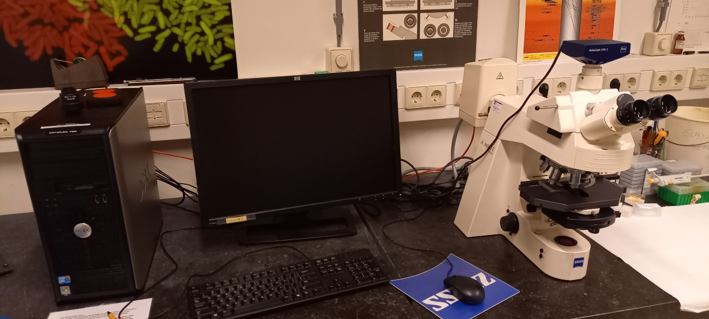  

- **Location**: Sylvius, Rm. 6.5.35  
- **Features**:  
    - Upright fluorescence microscope  
    - DIC optics  
    - Zeiss AxioCam MRc 5 digital color camera  
    - Filter blocks for DAPI, CFP, GFP, YFP, mCherry, DIC  
    - Custom filter options available (consult Bas or Joost)  
- [Book Widefield](https://www.supersaas.com/schedule/IBL_FluoWide/Fluorescence_widefield)  
- [Manual](dic.md)   

#### LEICA DM6000 (VAST)  
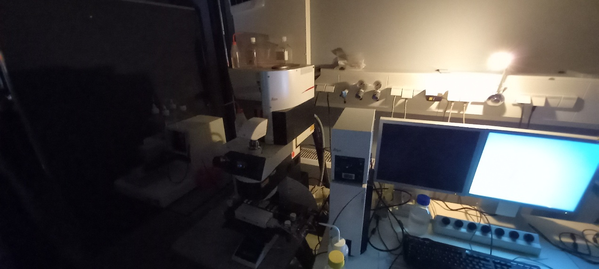  

- **Location**: Cell Observatory GW2.28  
- **Specifications**:  
    - Leica SL confocal CTR 6000  
    - DFC 450C camera  
    - VAST BioImager + LP Sampler (Union Biometrica)  
    - Laser lines:  
        - Ar: 457, 488, 515 nm  
        - HeNe: 543, 633 nm  
- [Book VAST](https://www.supersaas.com/schedule/IBL_VAST/VAST)

## Stereo Fluorescence/Light Microscopes  

#### Zeiss Axiozoom  V16  
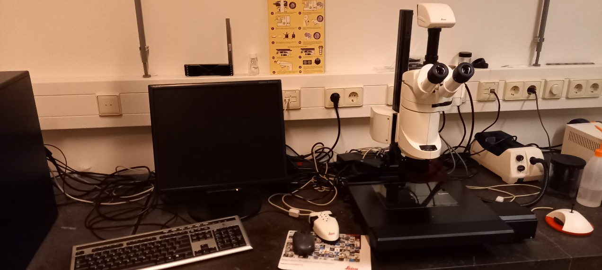  

- **Location**: Sylvius, Rm. 6.5.31b  
- **Capabilities**:  
    - Stereo fluorescence microscope  
    - Automated focus, zoom, and stage control  
    - Digital color camera  
    - Multiple filters (GFP, DSR, YFP, CFP, CY5, Alexa 405)  
    - Automated stage and incubation options  
- [Book Stereo Sylvius](https://www.supersaas.com/schedule/IBL_Stereo/Stereo_Sylvius)  

#### LEICA M205 FA (2)
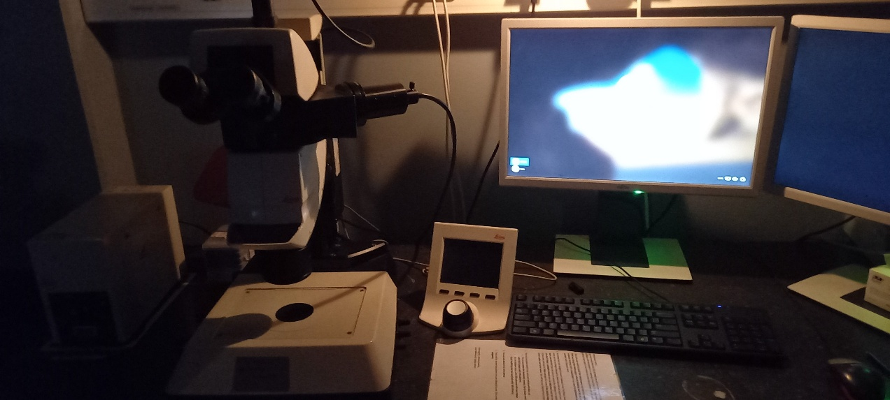  

- **Location**: Cell Observatory GW2.28  
- **Capabilities**:  
    - Stereo fluorescence microscope  
    - Multiple filters (GFP, DSR, YFP, CFP, CY5, Alexa 405)  
    - Leica DFC 345FX camera  
- [Book Stereo Gorlaeus](https://www.supersaas.com/schedule/IBL_Stereo/Stereo_Gorlaeus)

#### Zeiss V8  
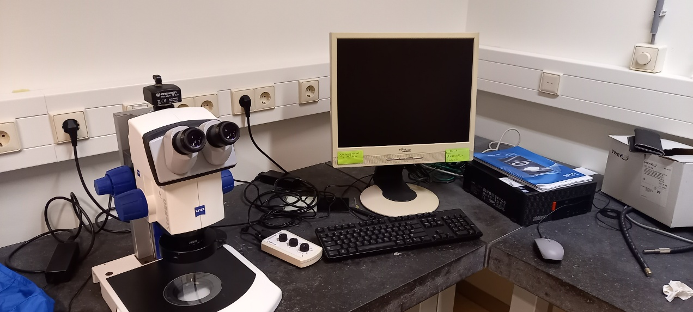  

- **Location**: Sylvius, Rm. 6.5.31a  
- **Capabilities**:  
    - Stereo light microscope  
    - Manual focus and zoom control  
    - Bresser digital color camera  
- [Book Stereo Sylvius](https://www.supersaas.com/schedule/IBL_Stereo/Stereo_Sylvius)

