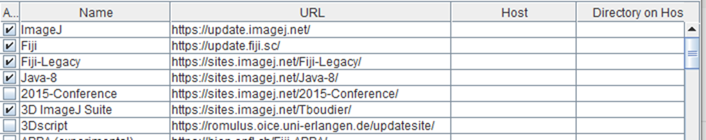
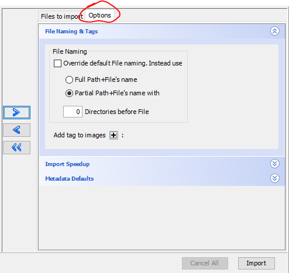

## Fiji image analysis for OMERO

While an official OMERO plugin for Fiji exists, which allows to load images from OMERO directly in Fiji and upload results and ROIs back to OMERO, at Leiden University we have our own developed plugin, which allows to directly run developed Fiji scripts/plugins on images in OMERO.

By following the steps below, you can install the required plugins and run your analysis on images in Fiji.

### Installation Steps

1. Install Fiji
2. Update Fiji and ensure all plugins are up to date (Help > Update)  
    - If you get errors, repeat the update (the updater might need multiple attempts)  
    - After seeing "Updated successfully. Please restart ImageJ!" message, restart Fiji  

3. After restarting, update again and click "Manage Update Sites"

4. Enable these required sites:  
    - Fiji legacy
    - 3D Image suite
    - ImageScience
    - Leiden University
    - PTBIOP

1. Click Close and Apply Changes
2. Restart Fiji
3. Install the Simple OMERO Client:  
    - Download from [GitHub releases](https://github.com/GReD-Clermont/simple-omero-client/releases)  
    - Place in Fiji's plugins folder  
    - Restart Fiji  

## Analysis Methods

### Manual Single Image Analysis

1. Open OMERO connection:  
    - Go to Plugins > OMERO > Connect to OMERO  
    - Login with ULCN credentials  
    - OMERO.insight connected to Fiji will open  

2. Access your image:  
    - Locate image in left sidebar or thumbnails  
    - Double-click to open  

3. Configure BioFormats Import:  
   
    - Adjust settings as needed
    - Click OK
    - Wait for loading (may take several minutes, no progress bar visible)

### Dataset Analysis

#### Manual Dataset Analysis

1. Launch dataset opener:
   - Go to Plugins > LeidenUniv > OMERO > Open OMERO dataset
   - Enter login credentials:
   

2. Select dataset:  
     
   - Choose group, user, project, and dataset
   - Click OK

3. Monitor progress:  
     
   - Watch log window for loading progress
  
4. Analyze your data creating either:
   Resultstables
   ROIs
   Images

5. Upload results to OMERO via Plugins>Omero>
   Save results to OMERO
   Save Rois to OMERO
   Save Image(s) to OMERO   

#### Automated Dataset Analysis

1. Start automated analysis:  
    - Go to Plugins > LeidenUniv > OMERO > Run OMERO plugin  
   - Enter login credentials:
   

2. Choose Plugin to run:  
     

3. Select dataset:  
   

4. Optionally set plugin parameters

5. View results after the plugin finishes:  
    - Results attach to image/dataset automatically  
     
   
   

!!! info
    If you need a plugin that isn't available, contact [Joost Willemse](mailto:jwillemse@biology.leidenuniv.nl) for assistance.

## Exporting Data

### Quick Downloads
- Use download button (yellow) on OMERO web interface:

- Choose export format:

### Large Dataset Downloads

1. In OMERO.insight:
    - Navigate to your dataset
    - Click download button
    

2. Select export format:
    
    - Download proceeds in background

## Server Scripts

Access server scripts through the web interface:

> ## Important Notes
> - Server is optimized for storage, not computation
> - Scripts may take significant time to process
> - All scripts must be tested on test-server first
> - **DO NOT develop or test scripts without admin consultation**
<!-- {blockquote:.is-danger} -->

For new script development, contact Joost Willemse.
