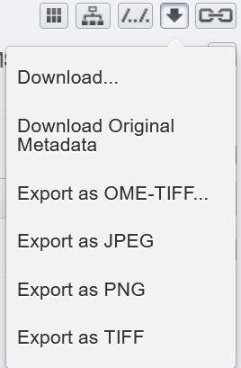
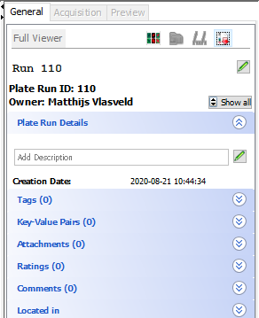

# Downloading and Exporting Data

This page describes how to download and export data from OMERO. When uploading data to OMERO the original files are always stored on the server, so if neccesary these can be retrieved if neccesary.

!!! question "Downloading a lot of data"
      If you would like to download a large amount of data from OMERO, e.g. for data sharing for a publication. Please reach out to the OMERO admins. We can help using a script to export the data more efficiently.

## OMERO.web Downloads

!!! info "Export Formats"
      With OMERO you can export in different formats
      Standard Formats
      - **Original Format**: Exact copy of the uploaded file
      - **OME-TIFF**: Standard microscopy format with OME metadata
      - **JPEG/PNG**: Only for presentations/publications
      - **TIFF**: Original pixel data, can be used for image analysis
### Quick Downloads
Access downloads through the OMERO web interface:

1. Locate your data
2. Click the download button at the right panel
3. Choose export format:
   - `Download...` Original files
   - `Download Original Metadata` Download original metadata only
   - `OME-TIFF format`
   - `JPEG` format
   - `PNG` format
   - `TIFF` format

!!! warning "Web Browser Timeout Limitation"
    Connections via the web browser automatically disconnect after 1 minute (60s), so often you won't be able to download large files. For larger datasets, use OMERO.insight instead.  

## OMERO.insight Downloads

### Large Dataset Downloads
1. Launch and log into OMERO.insight  
2. Navigate to your dataset  
3. Click the download button  
     
4. Select export format 

Downloads proceed in the background - no progress bar is shown, but the process remains active.

## Fiji Downloads

Alternatively you can use the OMERO Fiji plugin for downloading data. You can find more information [here](analysis/analysis_fiji.md#exporting-data)

