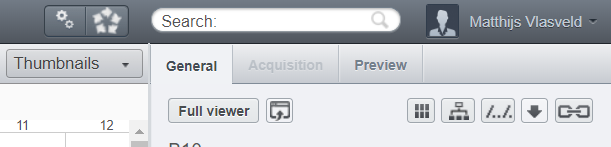
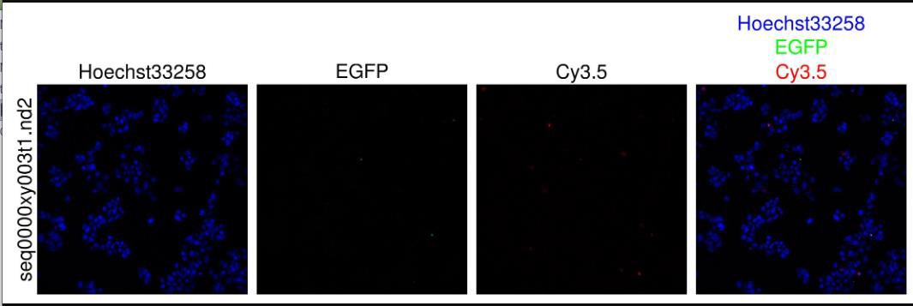

# Build figures with OMERO

A very helpful feature of OMERO is the ability to generate figure panels of your images directly from the web interface. This guide covers how to create figures in OMERO.

1)  Select the plate where you are interested in and click on a/multiple wells.

2)  Click on the publication options button (figure 1).

3)  Now you will get three options: Split View figure (1), Thumbnail figure (2) and Make Movie (3, only when you can image live). The split view figure will create a split view (figure 9) of the selected well(s), the thumbnail will create an small image (or set of images of your plate) and the movie makes a movie.

4)  Choose the option you would like and follow the steps in the menu. Once the figure/movie is ready, you can download it or show it in the browser by clicking on the \[Activities\] button and choose one of the options.

*Figure 1. You can find the publishing button at the location of the red square.*

*Figure 2. Output of the split view figure option. Here you see the different channels and a merged channel with the colors indicating the corresponding channel.*