# OMERO.figure

A very helpful feature of OMERO is the ability to generate figure panels of your images directly from the web interface. It is possible to:      

- add labels to the images in your figure, based on the metadata stored in OMERO.   
- add scale bars, and assure consistent image display settings across all images in your figure.   
- export figures as high-quality PNG or PDF files. It is possible to include the original images and a reference to the image data in OMERO.   

!!! note "Recommended Resources"
    - A user manual on OMERO.figure: <https://omero-guides.readthedocs.io/en/latest/figure/docs/omero_figure.html>  
    - An extensive tutorial on OMERO.figure: <https://downloads.openmicroscopy.org/help/pdfs/figure.pdf>
    - You can also watch this video tutorials on how to build figures on the official OMERO website <https://www.openmicroscopy.org/omero/figure/>    
    

## Building a figure from a plate

When your data is organised as a plate (e.g. from a high-content screen), OMERO.figure can pick up the well position and the well metadata automatically, so you do not have to label the panels by hand.

1. Open the plate in OMERO.web and select the wells you want in your figure. Hold `Ctrl` (`Cmd` on macOS) to select multiple wells. The fields of the selected wells appear in the panel below the plate; select the field(s) you want to use there.

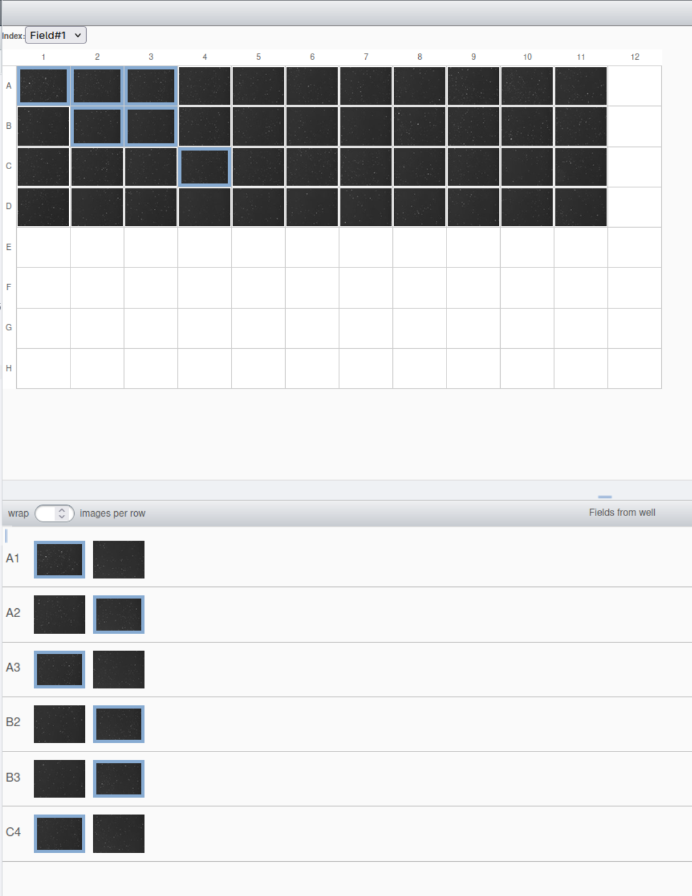{width=60%}

*Figure 1. Wells selected in the plate view. The selected fields per well are shown in the panel below.*

2. Click the `Open with` button in the right-hand panel and choose `OMERO.figure`.

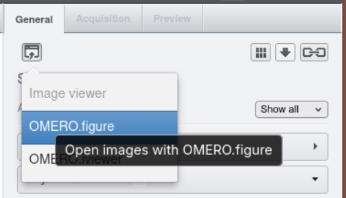{width=40%}

*Figure 2. Open the selected images with OMERO.figure.*

3. In OMERO.figure, select the panels you want to label and go to the `Labels` tab (1). Under `Add Labels` (2), open the dropdown next to the text field, choose `Well` and then `[well.label]`, and click `Add`.

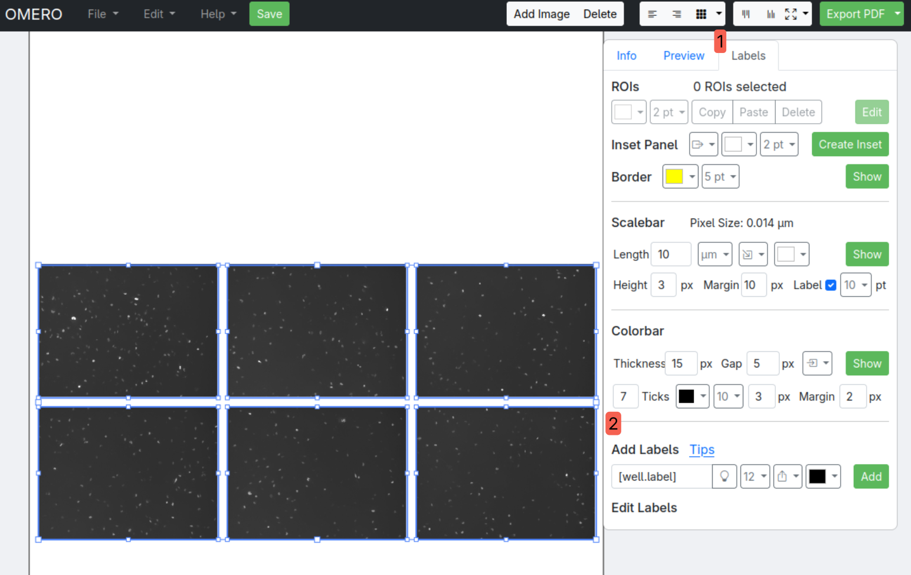{width=70%}

*Figure 3. The `Labels` tab in OMERO.figure. `[well.label]` inserts the well position of each panel.*

Each panel is now labelled with its own well position.

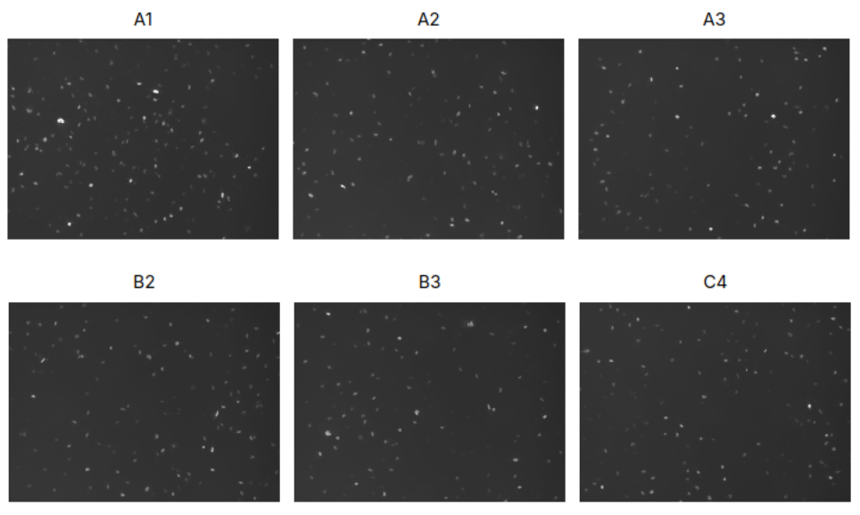{width=60%}

*Figure 4. Panels labelled with their well position.*

4. If you have annotated your wells with Key-Value Pairs (e.g. the treatment per well), you can add these as labels too. Choose `Key-Value pairs` from the same dropdown, pick the key you want to show and tick `Include Key in Label` if you want the key name displayed as well.

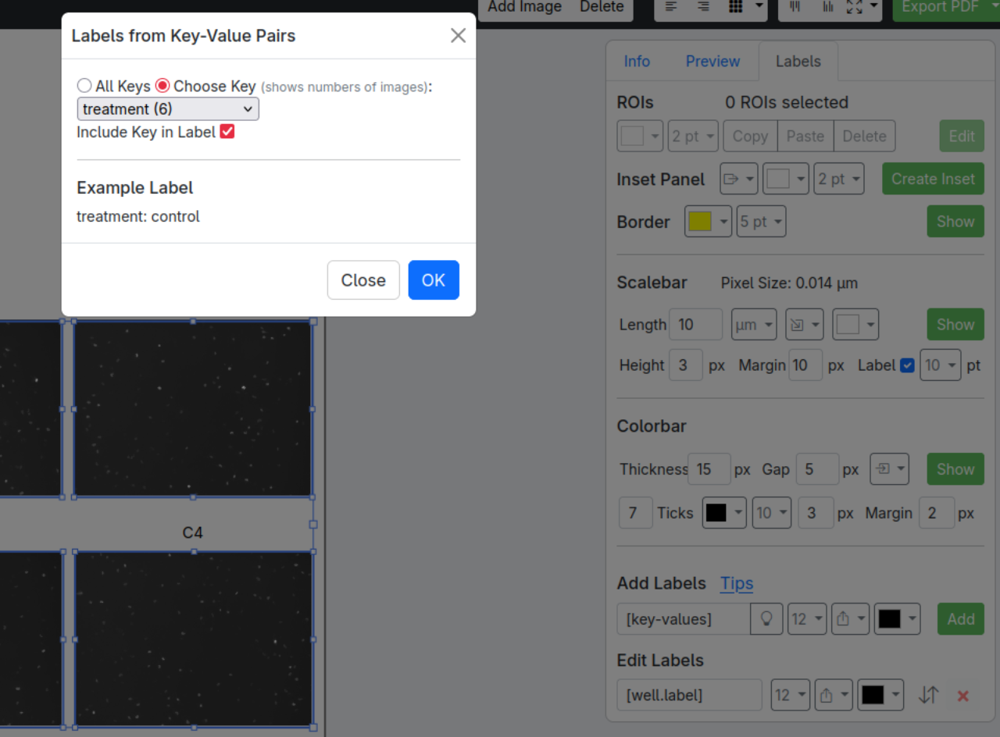{width=55%}

*Figure 5. Selecting the Key-Value Pair to use as a label. The example label shows what the result will look like.*

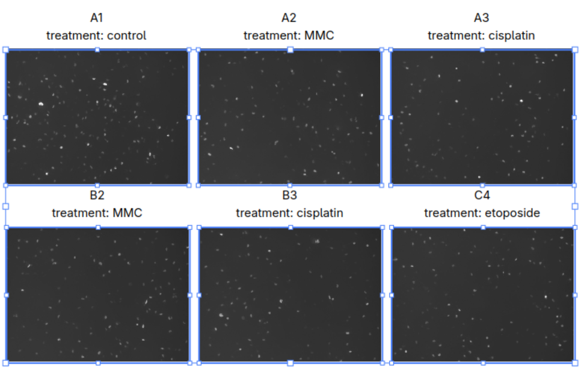{width=60%}

*Figure 6. Panels labelled with both the well position and the treatment stored as a Key-Value Pair.*

!!! tip "Adjust the display settings of a whole plate"
    To change the contrast of all thumbnails in a plate, do not open the images in the viewer. Instead, select a single image in a well, go to the `Preview` tab in the right-hand panel, adjust the display settings and click `Save to All`. The settings are applied to every image in the plate.

    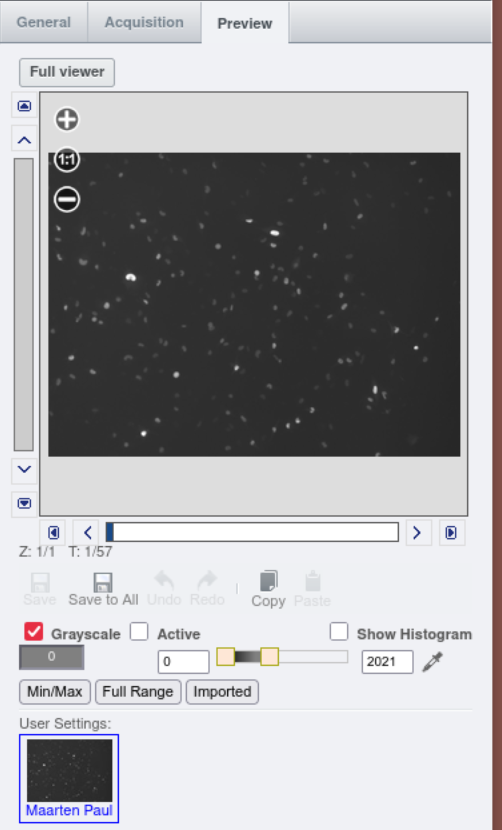{width=35%}

    *Figure 7. The `Preview` tab with the `Save to All` button.*

## Directly exporting a figure from OMERO.web
Apart from OMERO.figure, you can also create simple figures directly from the OMERO.web interface. This is a quick way to generate figures of your images or wells.

1. Select the dataset or plate where you are interested in and click on one or multiple wells or images images.
2. Click on the publication options button (figure 8).
3. Now you will get three options: Split View figure (1), Thumbnail figure (2) and Make Movie (3, only when you have time series). The split view figure will create a split view (figure 9) of the selected well(s), the thumbnail will create an small image (or set of images of your plate) and the movie makes a movie.
4. Choose the option you would like and follow the steps in the menu. Once the figure/movie is ready, you can download it or show it in the browser by clicking on the \[Activities\] button and choose one of the options.

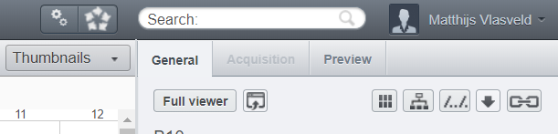

*Figure 8. You can find the publishing button at the button with 6 small rectangles.*

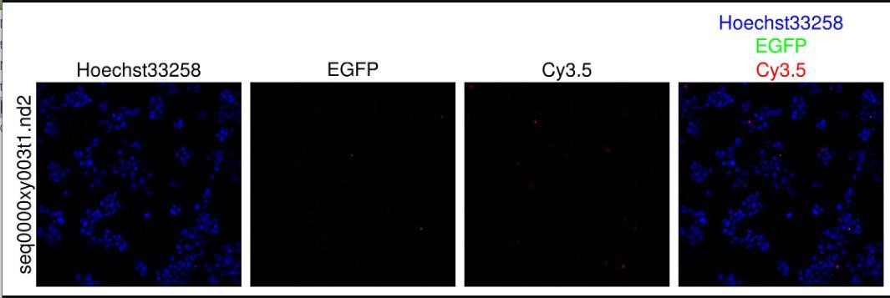

*Figure 9. Output of the split view figure option. Here you see the different channels and a merged channel with the colors indicating the corresponding channel.*

## Custom Z-projections
If you need to create custom z-projections for your images (e.g. from a subset of your slices), there is an option in OMERO.insight (software used for uploading images to OMERO) to save custom z-projections.

1. Open OMERO.insight and login to the OMERO server   
2. Open the image of interest in the viewer (double click on the image)    

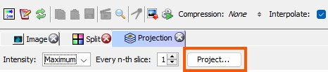

3. On the top select the projection tab
4. To create a custom z-projection click on `Project...`
5. Choose the desired settings of the z-slices and choose where to save the maximum projection. Press `Save`, now the projection image will be saved in OMERO and can be used in a figure.    

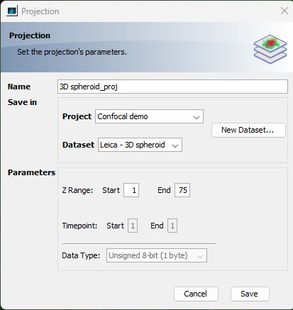