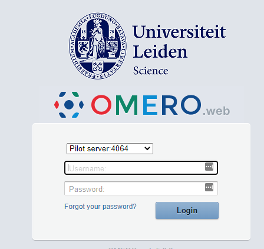
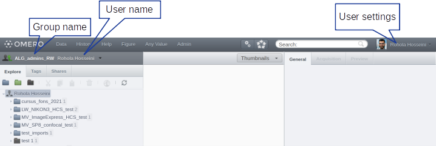
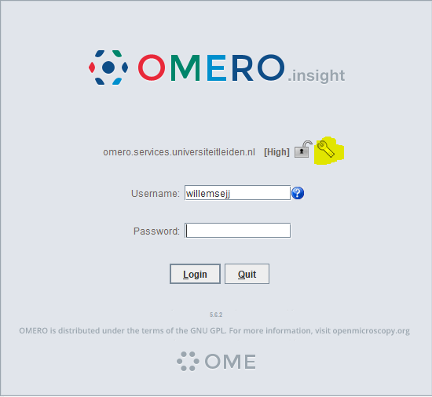

# Getting Started with OMERO

## Registration Process

To access OMERO, you need to be approved in the ULCN system. Please follow these steps:

1. Fill in the [registration form](https://forms.office.com/Pages/ResponsePage.aspx?id=dn8qytfbwE6RCGs9Uk-3yI5fAkzqGzlOrBwKM7sS2VtUMzQ3OVBHMUtUWDJSSFhSSVQxQkFUUUJFNyQlQCN0PWcu) 
2. Wait for approval from an [OMERO admin](index.md/#omero-administrators)
3. Complete your first login (see below)

!!! info "OMERO Groups"
    After your account is set up, you'll be able to see all data in your assigned group. Contact a OMERO admin if you need access to additional groups.

## First Time Login

> Important: Login must be done within the university network
<!-- {blockquote:.is-warning} -->

1. Visit the [OMERO Web Portal](https://omeroweb.services.universiteitleiden.nl/)

2. Login using your ULCN credentials
3. Logout after successful login
4. Inform your admin that you've completed the first login
5. :warning: Wait for confirmation that you've been assigned to the correct group before importing any data

## Remote Access

OMERO is only accessible from within the Leiden University network. When outside the network or when using wifi via EduRoam you will need to use EduVPN to access Leiden University OMERO.    
- Set up [EduVPN](https://helpdesk.universiteitleiden.nl/tas/public/ssp/content/detail/knowledgeitem?unid=600a6741-6a77-415c-85e1-ffbbf4839755) for a secure connection, then you are able to access OMERO directly from your laptop or PC.

## OMERO.insight Installation

For uploading data from your computer or downloading larger datasets, you'll need OMERO.insight:

1. Download [OMERO.insight](https://www.openmicroscopy.org/omero/downloads/)
2. Request installation:

      - Submit a [software request](https://helpdesk.universiteitleiden.nl/tas/public/ssp/content/serviceflow?unid=12e20347d517424a9c47edd22da4e9cc&from=a06b2d1a-e4da-49b9-ba8a-41117a176176&openedFromService=true), or
      - Request a [Admin by request account](https://helpdesk.universiteitleiden.nl/tas/public/ssp/content/serviceflow?unid=2c19d2f22cde4c509ff4958b173a2fba&from=b62ab85e-2bd2-4b36-9ba7-d85f263ac5db&openedFromService=true)

### Configuring OMERO.insight

1. Start OMERO.insight

2. Click the tool icon
   

3. Add the Leiden server:
   - Press the + sign
   - Enter server address: `omero.services.universiteitleiden.nl`
   - Click Apply

4. Login using your ULCN credentials
5. Now continue with [importing](importing.md) images or [downloading](downloading.md) data from OMERO

