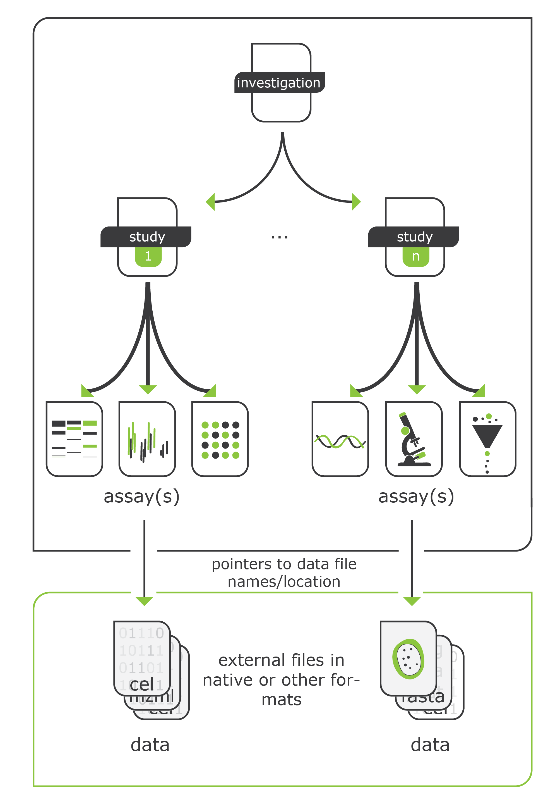

# Importing Data into OMERO

This section covers the general procedures for importing data into OMERO at the Leiden Cell Observatory. OMERO allows to organize our imaging data in a structured way. This makes the data findable and accessible for your research group.  
To make this possible, the data needs to be uploaded in a structured way and need to include the correct metadata. If you are not sure how to approach this, please contact the [OMERO admins](index.md#omero-administrators) or the data steward at your institute for help.

## Overview

OMERO.insight is the primary tool for importing data. This client is:

- Pre-installed on all microscope PC's
- Available for download on computers (Windows, Mac, Linux): <https://www.openmicroscopy.org/omero/downloads>
- Check [here](importing/microscope-files.md) how to upload specific file-types.

## Basic Import Workflow

1. **Prepare Your Data**
    - To make data accessible to others, use a consistent naming convention of your `Project` and `Dataset` names.
    - It is advised to organize your data according to the ISA model, which is a standard for organizing and sharing scientific data. This model organizes data in a hierarchical structure, which is similar to the way we organize our data in OMERO. The ISA model consists of three main components:

        - **Investigation:** An overarching description of the research project, this can be a consortium with multiple collaborators
        - **Study:** A specific research question within the investigation
        - **Assay:** A specific assay or analysis within the study

    {: style="height:450px"}   
    ///caption
    The ISA data model (adapted from Sansone et al. (2012)) 
    ///

    - Try to match the structure of your data in OMERO with the organization of your experiments in your Electronic Lab Journal (RSpace).
    - Prepare any metadata you want to include at the time of import.

2. **Launch OMERO.insight**
    - [Connect](getting-started.md#configuring-omeroinsight) to the server: `omero.services.universiteitleiden.nl`
    - Login with ULCN credentials
    - Navigate to your Group/project space

3. **Import Process**
    - Use `File > Import` or the import icon
    - Select the files for import
    - Choose or create projects/datasets or Screens/Plates
    - Use the omero.mde plugin to add [metadata](importing/metadata.md)
    - Add any additional tags or annotations
    - Review and start import

## Data Organization

### Project Structure
OMERO uses a two-level organization system:
- Projects (top level)  
- Datasets (within projects)  

Organize Datasets within Projects; avoid storing Datasets outside Projects

```
✅ Recommended Structure:
Project 1 (ISA: Study)
├── Dataset 1 (ISA: Assay 1)
│   └── image 1, etc.
└── Dataset 2 ((ISA: Assay 2)
    └── image 1, etc.

❌
├Dataset 1 (ISA: Assay 1)
│└── image 1, etc.
└Dataset 2 (ISA: Assay 1)
 └── image 1, etc.

```
To include the ISA:Investigation in the OMERO structure you should annotate the Project with metadata. This can be done with the [omero.mde](importing/metadata.md) plugin.


For (High-content) imaging screens OMERO offers: 
- Screens (top level)  
- Plates (within screens)  

!!! success "Planning Your Import"
    Before starting a large import:

    1. Plan your project/dataset structure
    2. Prepare experimental metadata at time of import
    3. Consider file type specific requirements

## Next Steps

- For importing specific file types, see [Microscope Files](importing/microscope-files.md)
- For high-content screening data, check [HCS Data](importing/hcs-data.md)
- To add metadata, refer to [Metadata Annotations](importing/metadata.md)