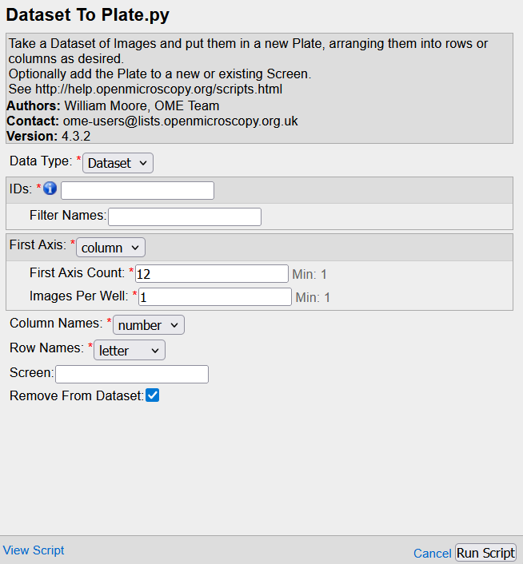

# High-Content Screening (HCS) Data

Importing HCS data into OMERO requires specific file handeling especially when .

## HCS Data Structure

OMERO handles the hierarchical organization of HCS data:
- Screen
   - Plate
     - Well
        - Field
          - Image with channels and timepoints

## Import Considerations

### Metadata Requirements
- Plate layout information
- Well naming conventions
- Experimental conditions
- Treatment annotations

### File Organization
1. Maintain original plate structure
2. Keep metadata files with raw data
3. Document plate layouts
4. Preserve screen/plate relationships

## Conversion from Dataset to plate
Whereas in some instances the data is directly imported as a plate (e.g. [ImageXpress](microscope-files.md#ImageXpress) however for some file formats this has to be done manually after importing.

Use can use a OMERO script for this which are available in the OMERO web interface at the right top (gear icon).
The basic script is available via:

``` OMERO scripts -> util_scripts -> Dataset to Plate ```

First select your data set, then load the script, than the parameters depending how your plate has been imaged (from left ot right, top to bottom, etc.). 



When you have not started imaging at well A1, or when you have imaged bi-directional you can use the alternative scripts:
   
   ``` OMERO scripts -> util_scripts -> Dataset to Plate Choose Start position ```
   - Here you can define a start position.
  
   ``` OMERO scripts -> util_scripts -> Dataset to Plate Start direction ```
  - This script allows for bidirectional conversion
