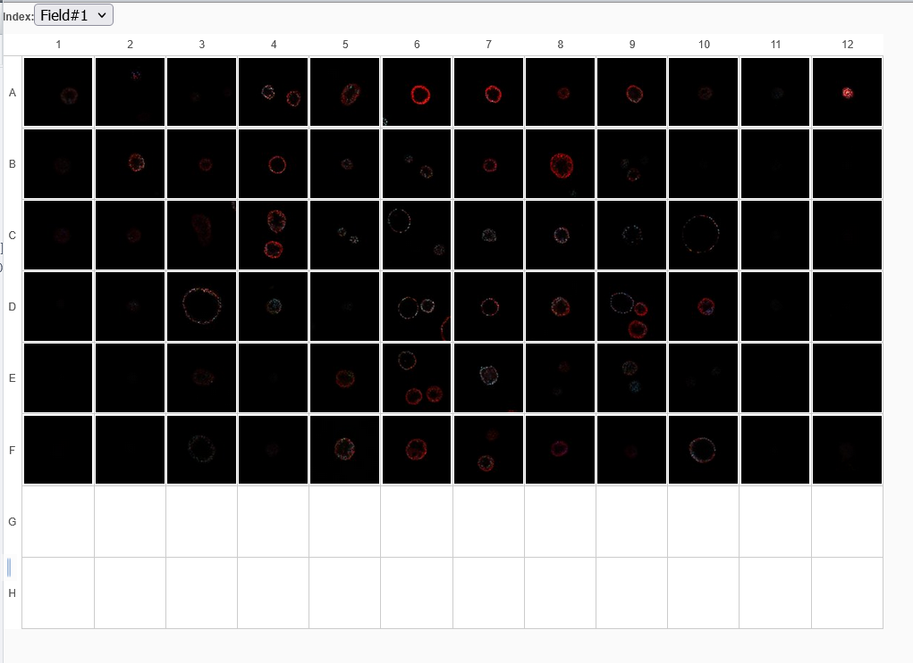
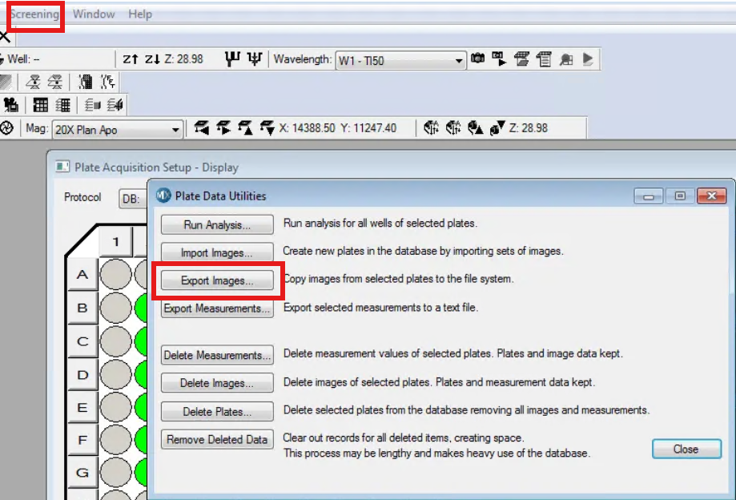

# High-Content Screening (HCS) Data

Unfortunately, different file formats and the OMERO system does not always work as expected. Especially with plate data and Nikon file formats. OMERO does not always recognizes the mapping of the wells correctly if there are any empty wells on your plate. This includes the edge wells, which is for our imaging set-up almost always the case. Thus, some pre-processing of the images is required. For correctly importing plate data and screens into OMERO it is advised to do this first time together with somebody experienced.


***Example of an plate in OMERO***

## HCS Data Structure

OMERO handles the hierarchical organization of HCS data:
```
Screen
└── Plate
     └── Well
        └── Field
             └── Image (with channels and/or timepoints)
```

## File Formats
### Pre-processing of Nikon data

1)  Open the ND2-file on the microscope PCs or on the Nis-elements analysis computer.

2)  Go to ```File > Import/Export ND document > Split multipoints```.

3)  Write down a descriptive prefix (be as specific as possible) and select a folder where you want to store the nd2 documents. Click on ```[Split]```.

4)  Now you should have a ND2 file for every well (and if multiple sites were imaged, every wellsite). This is something the OMERO system does recognize.

5)  Continue now at "uploading the images".

### Pre-processing of ImageXpress data

At the ImageXpress do **NOT** copy the TIF-files and thumbs directly from the database. Instead, export the images from the MetaXpress database in the software.

Exporting the images from the MetaXpress database will generate an additional ```.HTD``` file, which contains the metadata of the images (including which images belong to a plate, which is recognized by the string at the end of each image filename).

1. In the Imagexpress software at the top menu press ```Screening -> Plate Utilities```
2. Select ```Export images```
3. Choose your project and export to the hard drive.



4)  Continue now at "uploading the images". In the OMERO.insight software you only need to select the ```.HTD``` file.

!!! warning "Always export"
    Plates/screens that are copied directly from the database without export will not be recognized by the OMERO system. This can be fixed by manually create a .HTD file defining the plate layout. However, this approach is not recommended!
   
## Conversion from Dataset to Plate
Whereas in some instances the data is directly imported as a plate, however for some file formats this has to be done manually after importing.

You can use a OMERO script for this which are available in the OMERO.web interface at the right top (gear icon).
The basic script is available via:

``` OMERO scripts -> util_scripts -> Dataset to Plate ```

First select your data set, then load the script, than the parameters depending how your plate has been imaged (from left ot right, top to bottom, etc.). 


When you have not started imaging at well A1, or when you have imaged bi-directional you can use the alternative scripts:
   
   ``` OMERO scripts -> util_scripts -> Dataset to Plate Choose Start position ```
   - Here you can define a start position from where you have started imaging.
  
   ``` OMERO scripts -> util_scripts -> Dataset to Plate Start direction ```
  - This script allows for bidirectional conversion when you have imaged in a zigzag pattern.

!!! warning "Different Imaging Patterns"
    When you have imaged in a different pattern, e.g. there is not an equal number of images per well reach out to the facility for help.