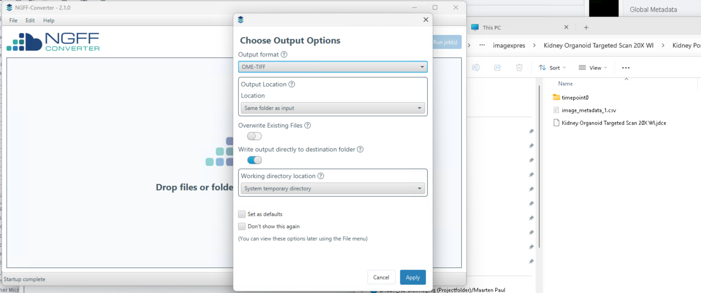
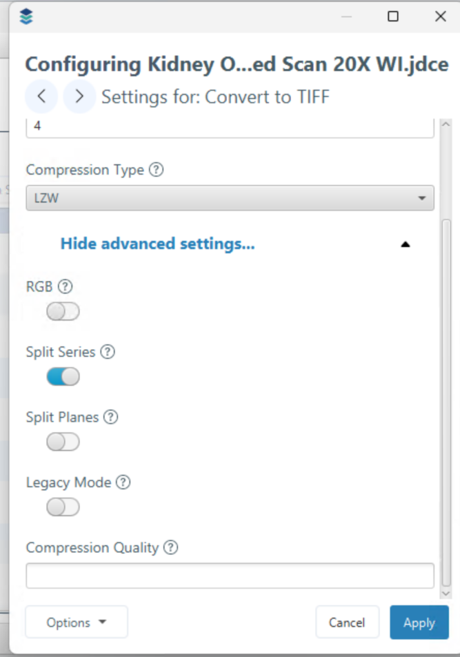
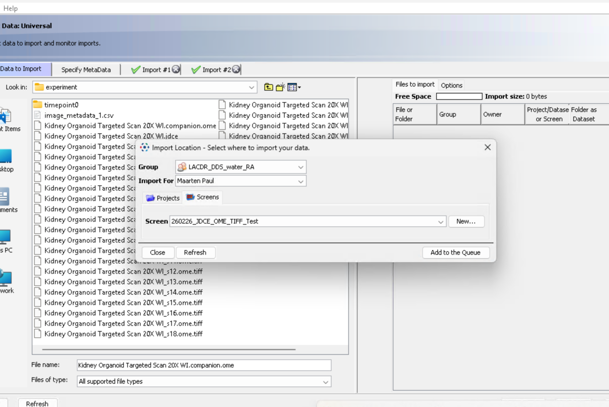

# Importing ImageXpress HCS.ai Data to OMERO

Data from the [ImageXpress HT.ai](../../microscopes/mic_pages/imagexpress-htai.md) is saved in the `.JDCE` file format. This is a relatively new file format and is **not** directly supported for upload to OMERO using OMERO.insight, as OMERO.insight by default uses an older version of [bioformats](https://www.openmicroscopy.org/bio-formats/).

- For now you can only upload data to OMERO from the ImageXpress microscope PC and the ImageXpress analysis PC, where we adjusted `OMERO.insight`.   
- To upload the data in OMERO.insight, browse to the folder with the data. Select only the `JDCE` file. Be aware that if you have acquired **z-stacks** there is a folder with the z-stack data and a folder with the maximum intensity projections. Generally it is recommended to upload the z-stack data, but you can additionally also upload the maximum intensity files if needed.    
- When you have acquired tile scans with the ImageXpress it is possible that the images are too large to be shown directly in OMERO. In that case follow the procedure below and convert the images to OME-TIFF first.

> **Warning**
> After converting images to OME-TIFF for OMERO, you will *not* be able to open them with InCarta software (that is the image analysis software provided by the vendor of the ImageXpress). **Always keep the original files** if you may need to analyze data with InCarta in the future.

## Converting Files to OME-TIFF

When you need to convert your files to OME-TIFF this can be done using the [NGFF-converter](https://www.glencoesoftware.com/products/ngff-converter/), which preserves most metadata from the original files.

### Step-by-step Instructions

1. **Locate your `.JDCE` file**
	- Go to the folder containing your ImageXpress data.
	- Each experiment may have several folders, such as `experiment`, `experiment_z_stack`, and `experiment_montage`, each with its own `.JDCE` file.
	- If you acquired z-stacks, `experiment_z_stack` contains the original z-stack, `experiment` contains maximum intensity projections, and `experiment_montage` contains stitched images.

2. **Open NGFF-Converter**
	- Launch the NGFF-Converter application. This application is installed on the image analysis workstation next to the ImageXpress.
	- Drag your `.JDCE` file into the application window. You will see a popup.
	

3. **Select Output Format**
	- Choose **OME-TIFF** as the output format and press **OK**.

4. **(Optional) Split Large Datasets**
	- By default, data is saved as a single OME-TIFF file. For large datasets, this file can become very large and hard to handle.
	- To split the OME-TIFF file per field-of-view:
	  - Press the **Settings** button next to your file in the main window.
      - Use the right arrow on top of the popup to select TIFF
	  - Click **Advanced Settings**.    
        {width=40%}     
	  - Toggle **Split Series** on.
	  - Click **Apply**.

5. **Run the Conversion**
	- Press **Run** and wait for the conversion to finish. By default the converted files will be saved in the same folder.

## Upload to OMERO

6. **Upload with OMERO.insight**
	- Open OMERO.insight.
	- Look for the `*.companion.ome` file generated by the converter. Select this file to upload. You do not need to select all the other OME-TIFF files.
	- In OMERO.insight, create a new screen with your desired name and upload the data.
	{width=80%}     