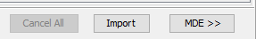
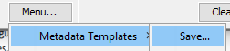
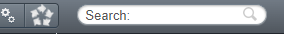

# Metadata annotations

By providing metadata annotations to your imaging data.

## Types of Metadata

OMERO supports several types of metadata annotations:  

- Tags  
- Key-value pairs  
- Comments  
- Files (attachements)
- ROIs  

## Adding Metadata During Import

Using OMERO.insight experimental metadata can be added during the import of your data.

### Setting up OMERO insight for metadata annotations

First you need to load a OMERO mde configuration file. This file contains the metadata templates that are used to annotate your data. The configuration file is a XML file that contains the metadata templates and their properties.

1.  Save the OMERO mde configuration file in the "Users\\\$User\\OMERO" folder, save it as mdeConfiguration.xml

> You can find the file here: [mdeConfiguration.xml](https://github.com/Leiden-Cell-Observatory/metadata_templates/tree/main/mde_templates)

2.  Use OMERO insight as normal to [import](../importing.md) data.

3.  **[Do NOT press import yet]**

4.  Press the MDE button next to import.

5.  At the left bottom of the screen select the right metadata model you want to use

6.  Use MiBMe (Minimal Biological Metadata), of MiHCSMe (Minimal High Content Screening Metadata) for HCS experiments.

7.  Fill in all the data (first time only) or next time load your data via

8. Your file should now look something like this:

9. If you want to re-use the input, **save the file locally for re-use** . Preferably save it with your experiments, or attach it to the OMERO project. 

10.   Now proceed to import your images

11.   The metadata is stored with your images and searchable in OMERO via the searchbar on the right top of the browser

## Metadata templates

### Minimal Information for High Content Screening in Microscopy Experiments (MIHCSME)
Next to adding metadata through OMERO.insight the metadata template in Excel to describe your screen at different levels (Study, Assay, and per Plate and Well) should be used. 

The template can be found at [this repository](https://github.com/Leiden-Cell-Observatory/metadata_templates/tree/main/MIHCSME_template), with some filled-in examples.

The templates can also be found here: <https://fairdomhub.org/investigations/575>

## Adding Metadata templates to OMERO
### Attaching a description, metadata and quantified results to your images

The current recommendation is to attach metadata template to your images in OMERO. Items to add are the metadata template (mandatory), library files (if applicable) and the plate layouts. At the right side of the screen you can add those items.

1)  Give your plate a short, descriptive description by clicking on the pencil icon (red box). It is optional to add some tags as well. This might help to retrieve the data more easy later on.

2)  Add the (mandatory) attachments to the file using the attachment section (green box). This includes the metadata template in pdf format and all additional files.

*Overview of screen where you can describe the data that is in a plate and add the attachments.*