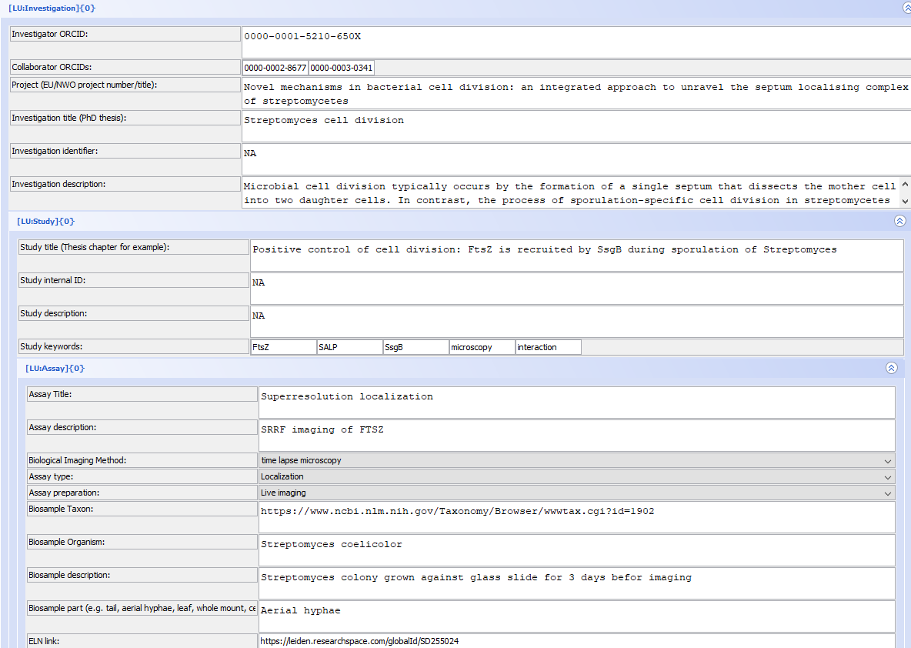

# Metadata Annotations

This guide covers how to add and manage metadata annotations in OMERO.

## Types of Metadata

OMERO supports several types of metadata annotations:
- Tags
- Key-value pairs
- Comments
- Files
- Ratings

## Adding Metadata During Import

### Setting up OMERO insight for metadata annotations

1.  Save the OMERO mde configuration file in the "Users\\\$User\\OMERO" folder, save it as mdeConfiguration.xml

> You can find the file here: [mdeConfiguration.xml](https://leidenuniv1.sharepoint.com/:u:/r/sites/CellObservatory-OMERO/Shared%20Documents/General/Metadata/mdeConfiguration.xml?csf=1&web=1&e=fpXQDx)

2.  Use OMERO insight normally to [import](importing.md) data

3.  **[Do NOT press import yet]**

4.  Press the MDE button next to import

5.  At the left bottom of the screen select the right metadata model you want to use

6.  Use MiBMe (Minimal Biological Metadata), of MiHCSMe (Minimal High Content Screening Metadata)

7.  Fill in all data (first time only) or load your data via

8. Your file should now look something like this

 

9. If you want to re-use the settings, **save the file locally for re-use**

10.  preferably with your experiments, or attach it to the OMERO project. 

11.  Now proceed to import your images

12.  The metadata is stored with your images and searchable in OMERO via the searchbar on the right top of the browser

## Adding Metadata templates to OMERO
### Attaching a description, metadata and quantified results to your images

To make the data FAIR, you will have to attach metadata to your images. Items to add are the metadata template (mandatory), library files (if applicable) and the plate layouts. At the right side of the screen you can add those items.

1)  Give your plate a short, descriptive description by clicking on the pencil icon (figure 11, red box). It is optional to add some tags as well. This might help to retrieve the data more easy later on.

2)  Add the (mandatory) attachments to the file using the attachment section (figure 11, green box). This includes the metadata template in pdf format and all additional files.

*Overview of screen where you can describe the data that is in a plate and add the attachments.*