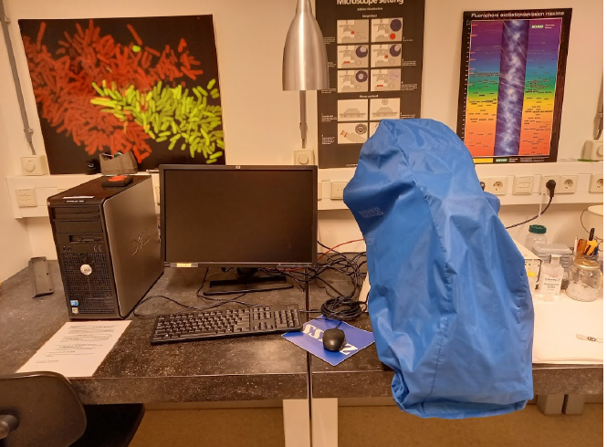
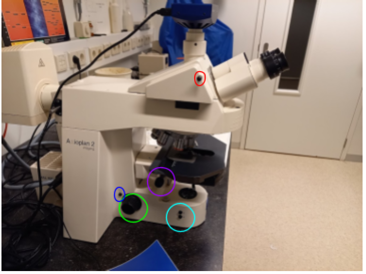
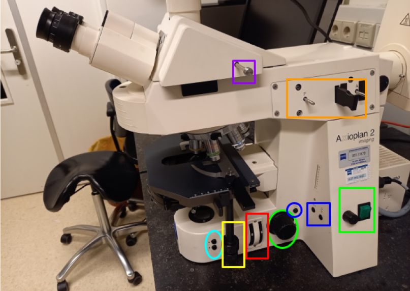
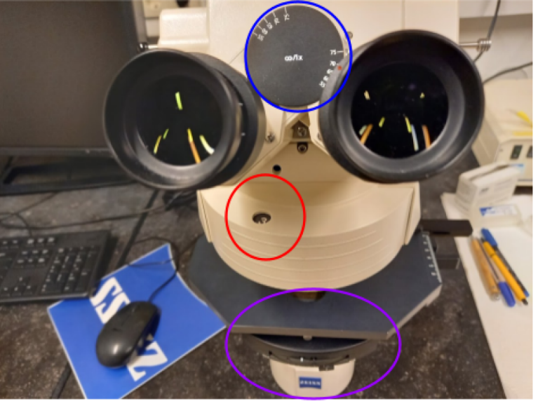
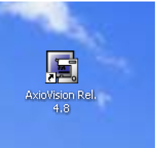
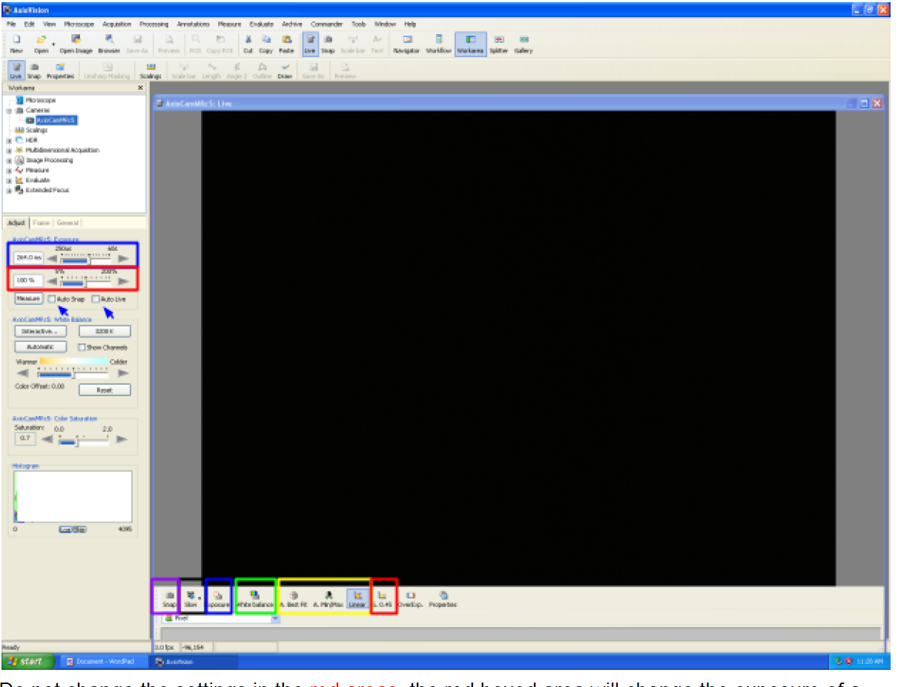
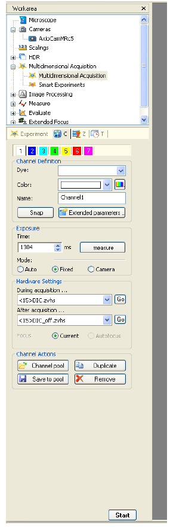
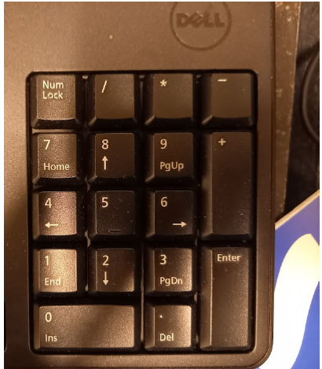

# DIC Microscope Manual

## Hardware Controls

### Left Side Controls

- **Focus Wheel**: Main focus control (green)
- **Focus Mode Switch**: Toggle between coarse and fine focus (dark blue)
- **Sample Exchange Buttons**: (cyan)
  - Lower stage for sample removal
  - Return to previous focus height
  - *Note: Disable this feature when sample heights vary to prevent objective crashes*
- **Condenser Focus Wheel**: (purple) Used for Köhler illumination
- **Ocular Light Block**: Red pin that blocks light to oculars when pushed in

### Right Side Controls

- **Focus Controls**: 
  - Focus wheel (green oval)
  - Sample loading positions (cyan)
  - Fine/Course focus switch (dark blue)
- **Light Controls**:
  - Power switch with intensity control (green)
  - Light Manager buttons for 3200K illumination
- **Stage Control**: XY positioning (yellow)
- **Filter Controls**:
  - Neutral density filter wheels (red)
  - Fluorescence light path adjustments (orange)
  - Beam path switch (purple)

## Illumination System

### Light Manager Features
- Left button: Toggle between 3200K and manual control
- Right button: Switch between brightfield and fluorescence
- Neutral density filters available for intensity reduction while maintaining color balance

### Light Path Controls
The beam path switch offers three positions:
1. Oculars only
2. Camera only
3. 50/50 split (enables simultaneous viewing and live imaging)

## Filter System

### Filter Wheel Positions

1. UV (DAPI, Hoechst)
2. CFP and cyan dyes
3. GFP, FITC, green fluorescent dyes
4. YFP
5. TRITC, rhodamine, propidium iodide, mCherry
6. Transmitted light (with/without DIC)
7. Empty
8. Empty

### Condenser Settings
- **I/BF**: Brightfield and DIC
- **2, 3**: Phase contrast or DIC (II and III)
- **D**: Darkfield (20x objectives and lower)
- Adjustable condenser diaphragm for contrast/resolution control

## Software Operation (AxioVision)

### Initial Setup

1. Login to the system
2. Start AxioVision
3. Configure storage settings:
   - Set autosave location
   - Choose file format (ZVI recommended for full metadata)
4. Configure naming conventions for single and multi-dimensional acquisitions

### Image Acquisition

#### Basic Imaging

1. Select correct objective in microscope menu
2. Focus on sample
3. Switch to live view
4. Adjust camera settings:
   - Set exposure time (manual or auto)
   - Use white balance for color correction
   - Configure display settings (linear/min/max/best fit)

> Never modify gamma settings during quantitative imaging as it affects intensity relationships.
<!-- {blockquote:.is-warning} -->

#### Multidimensional Acquisition

- Predefined channel settings available
- Individual exposure times per channel
- Automatic overlay generation

### Keyboard Shortcuts

- Numpad 1-7: Filter wheel positions and shutter control
- Spacebar/F2: Take snapshot
- Each numpad number corresponds to specific filter settings:
  1. All shutters closed
  2. UV (DAPI)
  3. CFP
  4. GFP/FITC
  5. YFP
  6. TRITC/mCherry
  7. Transmitted light

## Best Practices

1. **Fluorescence Lamp Usage**
   - Turn off when finished if no users within 30 minutes
   - Allow 30-minute cooldown period
   - Limited bulb lifetime - avoid unnecessary use

2. **Image Quality**
   - Use appropriate phase contrast settings
   - Optimize DIC prism position for best contrast
   - Consider neutral density filters for bright samples

3. **Data Management**
   - Store data on designated data disk
   - Create personal folder for organization
   - Use ZVI format to preserve metadata

> For optimal image quality, ensure proper Köhler illumination setup and appropriate condenser settings for your chosen imaging mode.
<!-- {blockquote:.is-info} -->