# IBL Microscopes

## Stereo Microscopes

### Sylvius Location (Room 6.5.31)

#### Zeiss Stereo Zoom V16
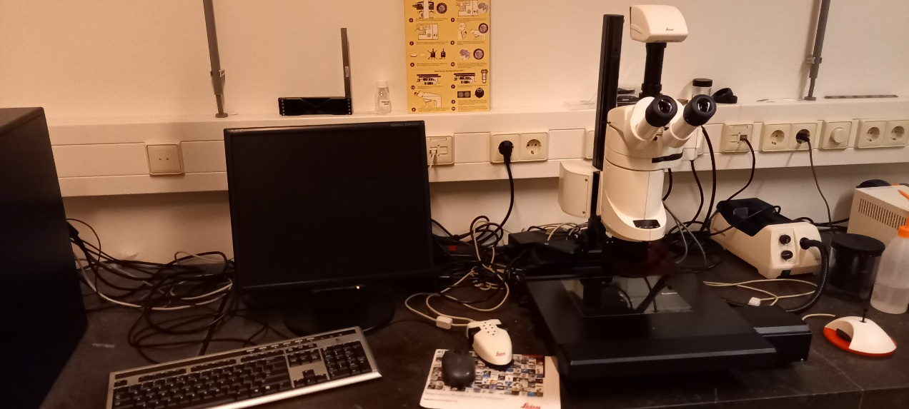
- **Location**: Sylvius, Rm. 6.5.31b
- **Capabilities**:
  - Stereo fluorescence microscope
  - Automated focus, zoom, and stage control
  - Digital color camera
  - Multiple filters (GFP, DSR, YFP, CFP, CY5, Alexa 405)
  - Automated stage and incubation options
- [Book Stereo Sylvius](https://www.supersaas.com/schedule/IBL_Stereo/Stereo_Sylvius)

#### Zeiss V8
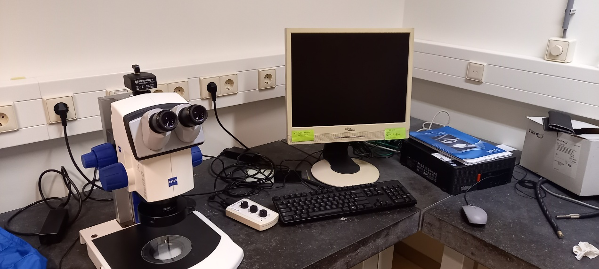
- **Location**: Sylvius, Rm. 6.5.31a
- **Capabilities**:
  - Stereo light microscope
  - Manual focus and zoom control
  - Bresser digital color camera
- [Book Stereo Sylvius](https://www.supersaas.com/schedule/IBL_Stereo/Stereo_Sylvius)

### Gorlaeus Location
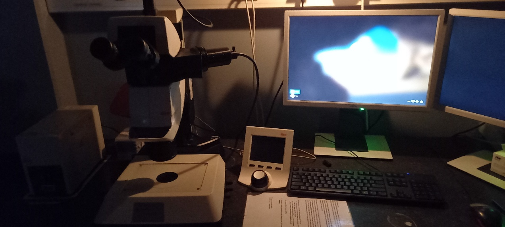

#### Stereo Fluorescence Microscope
- **Location**: Cell Observatory GW2.28
- **Capabilities**:
  - Multiple filters (GFP, DSR, YFP, CFP, CY5, Alexa 405)
  - Leica DFC 345FX camera
- [Book Stereo Gorlaeus](https://www.supersaas.com/schedule/IBL_Stereo/Stereo_Gorlaeus)

## Fluorescence Compound Microscopes

### [Zeiss Observer](/microscopes/widefield-observer)
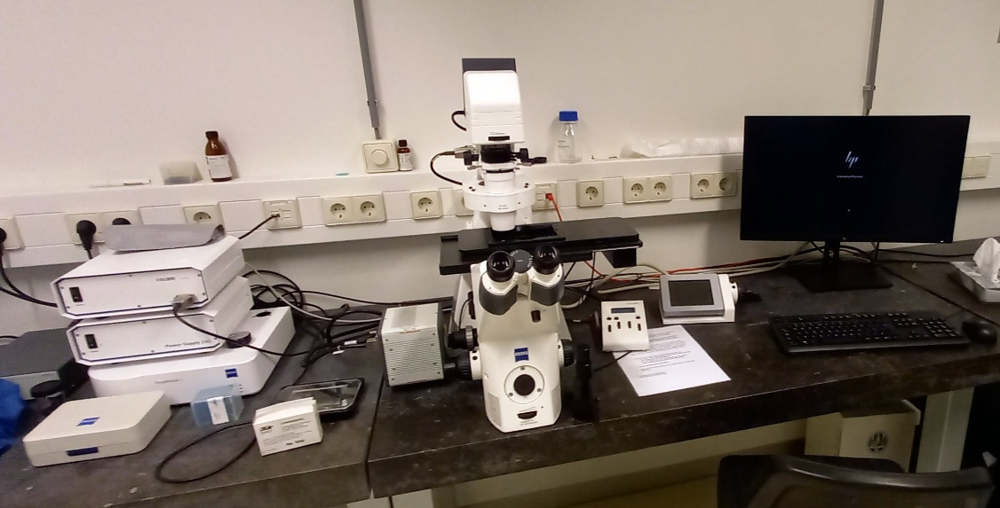
- **Location**: Sylvius, Rm. 6.5.31a
- **Features**:
  - Widefield fluorescence with Colibri system
  - DAPI, GFP, and mCherry filters
  - Automated stage
  - Hamamatsu EMCCD
  - Multi-well imaging capability
- [Book Observer](https://www.supersaas.com/schedule/IBL_FluoWide/Observer_widefield)
- [Detailed Multi-well Imaging Guide](/microscopes/widefield-observer)

### Zeiss Axioscope A1
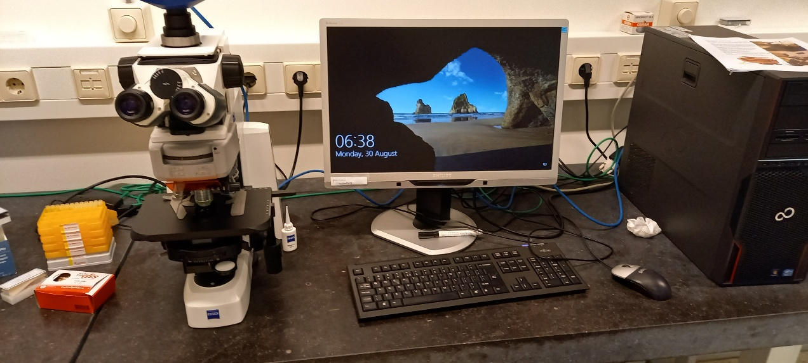
- **Location**: Sylvius, Rm. 6.5.31a
- **Features**:
  - Widefield fluorescence with Colibri system
  - DAPI, GFP, and mCherry filters
- [Book Widefield](https://www.supersaas.com/schedule/IBL_FluoWide/Fluorescence_widefield)

### [Zeiss Imager M2 (DIC)](/microscopes/dic)
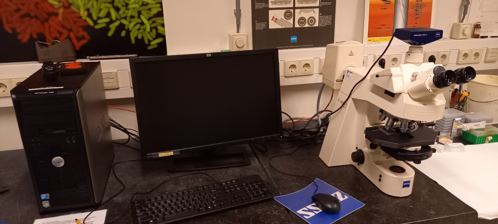
- **Location**: Sylvius, Rm. 6.5.35
- **Features**:
  - Upright fluorescence microscope
  - DIC optics
  - Zeiss AxioCam MRc 5 digital color camera
  - Filter blocks for DAPI, CFP, GFP, YFP, mCherry, DIC
  - Custom filter options available (consult Gerda or Joost)
- [Book Widefield](https://www.supersaas.com/schedule/IBL_FluoWide/Fluorescence_widefield)
- [Detailed DIC Manual](/microscopes/dic)

### [Nikon A1](/microscopes/a1)
- **Location**: Listed under Nikon Systems
- **Features**:
  - LED-based fluorescence excitation
  - Multiple fluorescence channels
  - Phase contrast capability
- [Detailed A1 Manual](/microscopes/a1)

## Confocal Microscopes

### Zeiss Airyscan 900
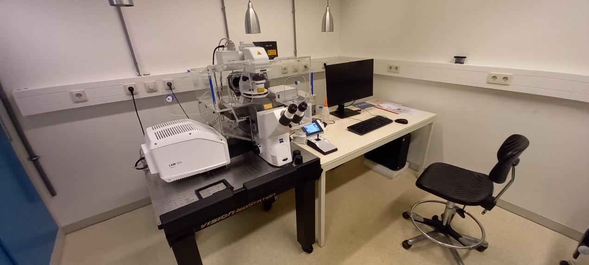
- **Location**: Sylvius, Rm. 6.5.32
- **Specifications**:
  - Inverted confocal laser scanning microscope
  - Temperature-controlled incubation
  - Automated stage control
  - Three fluorescence detector channels
  - One transmitted light channel
  - Laser lines: 405, 488, 543, and 633 nm
- [Book Confocal](https://www.supersaas.com/schedule/IBL_Confocal/Confocals)
- [View Instructions](https://video.leidenuniv.nl/media/t/1_40bwf016)

### Zeiss LSM5 Exciter / AxioImager
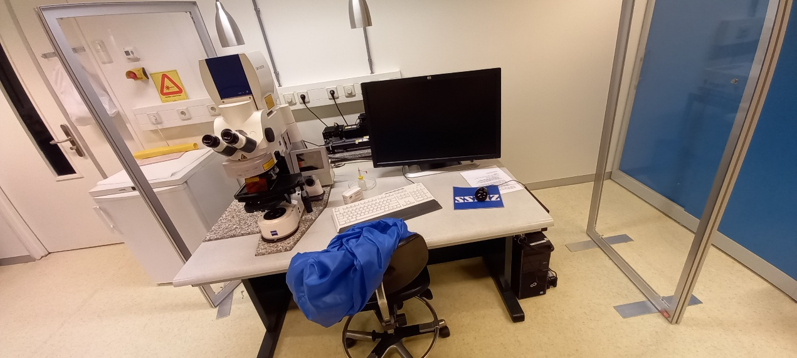
- **Location**: Sylvius, Rm. 6.5.32
- **Specifications**:
  - Upright confocal laser scanning microscope
  - Two fluorescence detector channels
  - One transmitted light channel
  - Laser lines: 458, 488, 514, 543, and 633 nm
- [Book Confocal](https://www.supersaas.com/schedule/IBL_Confocal/Confocals)
- [View Instructions](https://video.leidenuniv.nl/media/t/1_6vcjjhfu)

### Leica TCS SPE
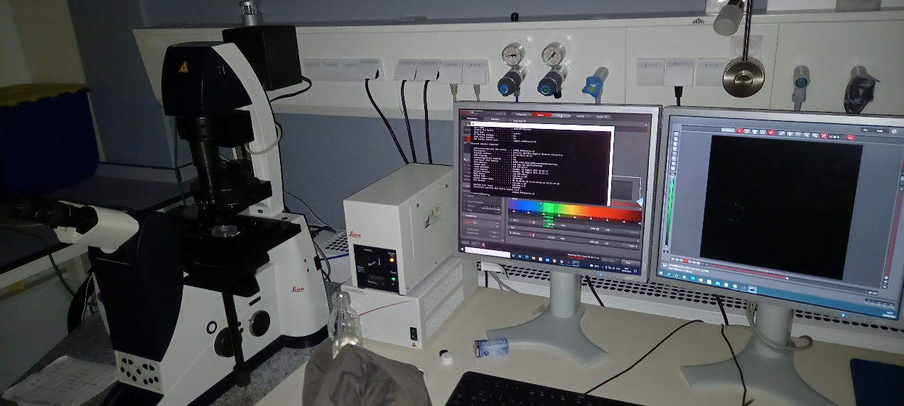
- **Location**: Cell Observatory GW 2.30a
- **Specifications**:
  - Inverted confocal laser scanning microscope
  - One spectral detector channel for fluorescence
  - One transmitted light channel
  - Laser lines: 488, 532, and 633 nm
- [Book Confocal](https://www.supersaas.com/schedule/IBL_Confocal/Confocals)
- [View Instructions (Dutch)](https://video.leidenuniv.nl/media/t/1_498i179v)

### Leica SP8
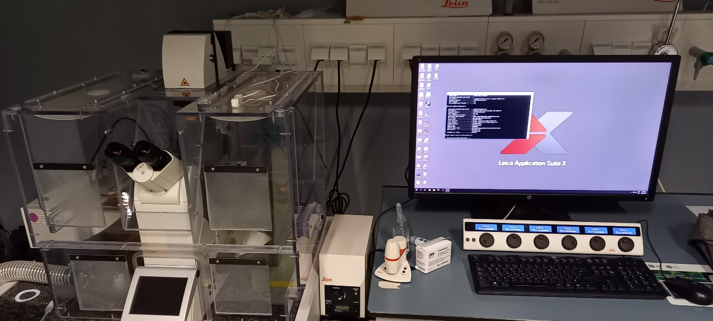
- **Location**: Cell Observatory GW 2.30a
- **Specifications**:
  - Inverted confocal laser scanning microscope
  - Three spectral detector channels (2 PMT, one GASP)
  - One transmitted light channel
  - Laser lines: 405, 488, 532, and 633 nm
- [Book Confocal](https://www.supersaas.com/schedule/IBL_Confocal/Confocals)
- [View Instructions](https://video.leidenuniv.nl/media/t/1_0bxcqbo8)

## Electron Microscopes

### JEOL SEM 7600
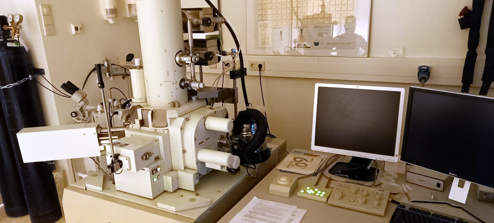
- **Location**: Sylvius, Rm. 6.5.34
- **Features**:
  - Conventional high vacuum scanning electron microscope
  - Digital imaging
  - Cryo-unit for freezing, coating and imaging
  - EDS for elemental analysis
- [Book SEM](https://www.supersaas.com/schedule/IBL_SEM/IBL_SEM)

### JEOL TEM 1400+
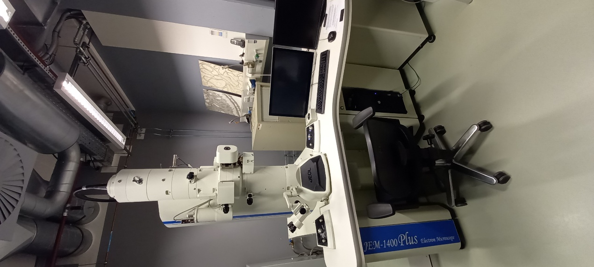
- **Location**: Cell Observatory GW2.24a
- **Specifications**:
  - 120 kV transmission electron microscope
- [Book TEM](https://www.supersaas.com/schedule/IBL_TEM/TEM)

## Specialized Systems

### LEICA DM6000 (VAST)
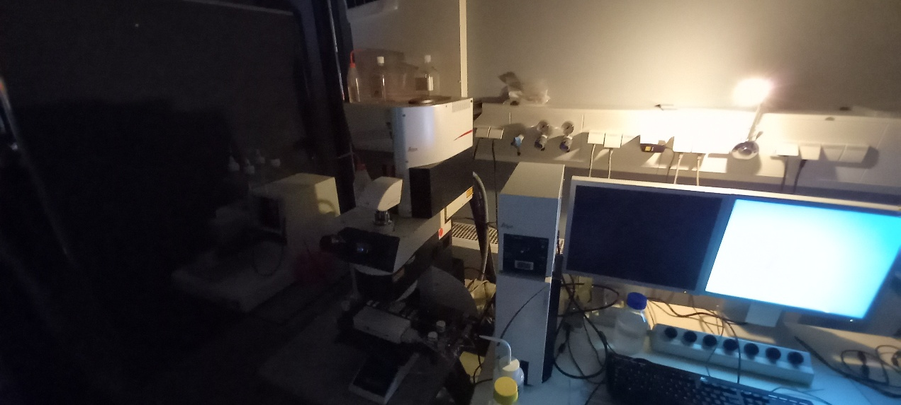
- **Location**: Cell Observatory GW2.28
- **Specifications**:
  - Leica SL confocal CTR 6000
  - DFC 450C camera
  - VAST BioImager + LP Sampler (Union Biometrica)
  - Laser lines:
    - Ar: 457, 488, 515 nm
    - HeNe: 543, 633 nm
- [Book VAST](https://www.supersaas.com/schedule/IBL_VAST/VAST)

> Contact facility staff for training before first use of any microscope system.
<!-- {blockquote:.is-info} -->