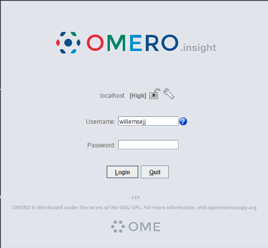
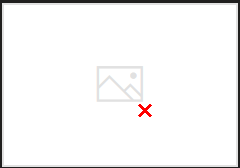
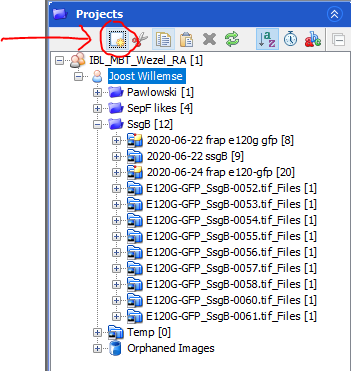
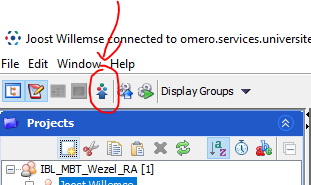
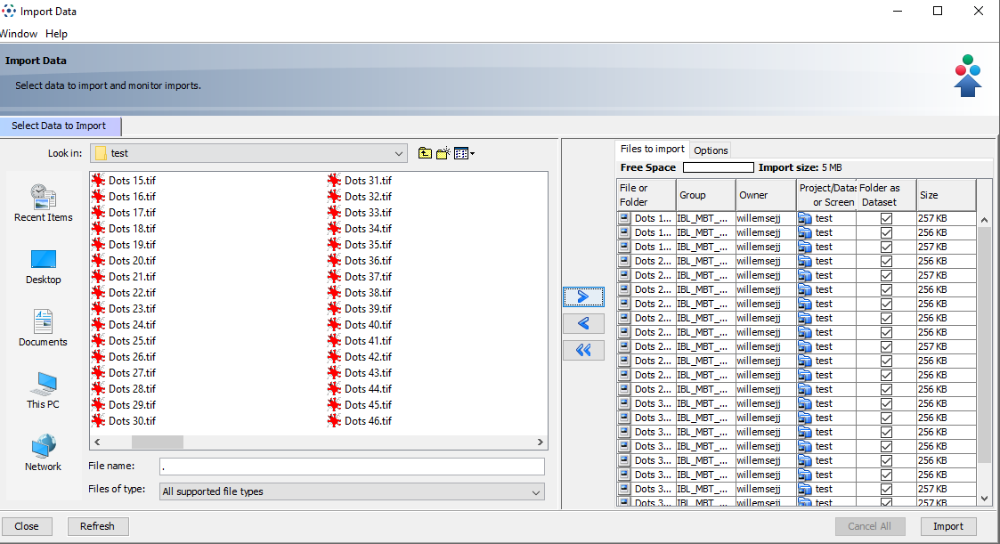
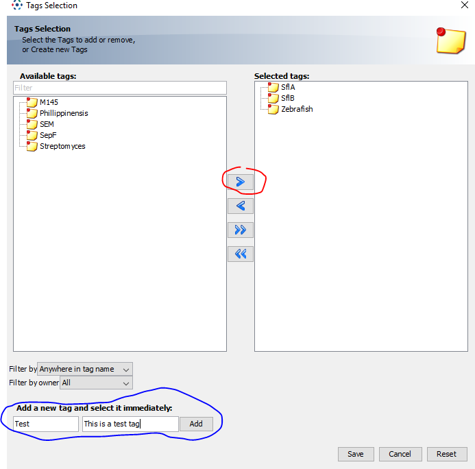
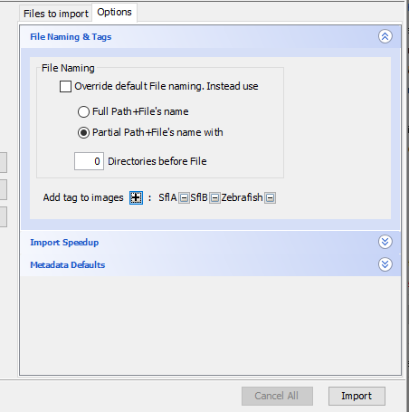
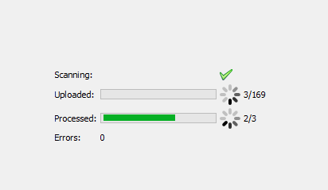

# Data Analysis with OMERO

There are different ways you can interact with data in OMERO.

## Setting Up Fiji for OMERO

### Installation Steps

1. Install Fiji
2. Update Fiji and ensure all plugins are up to date (Help > Update)
   - If you get errors, repeat the update (the updater might need multiple attempts)
   - After seeing "Updated successfully. Please restart ImageJ!" message, restart Fiji

3. After restart, update again and click "Manage Update Sites"

4. Enable these required sites:
   - Fiji legacy
   - 3D Image suite
   - ImageScience
   - Leiden University

5. Click Close and Apply Changes
6. Restart Fiji
7. Install the Simple OMERO Client:
   - Download from [GitHub releases](https://github.com/GReD-Clermont/simple-omero-client/releases)
   - Place in Fiji's plugins folder
   - Restart Fiji

## Analysis Methods

### Manual Single Image Analysis

1. Open OMERO connection:
   - Go to Plugins > OMERO > Connect to OMERO
   - Login with ULCN credentials
   - OMERO insight connected to Fiji will open

2. Access your image:
   - Locate image in left sidebar or thumbnails
   - Double-click to open

3. Configure BioFormats Import:
   
   - Adjust settings as needed
   - Click OK
   - Wait for loading (may take several minutes, no progress bar visible)

### Dataset Analysis

#### Manual Dataset Analysis

1. Launch dataset opener:
   - Go to Plugins > LeidenUniv > OMERO > Open OMERO dataset
   - Enter login credentials:
   

2. Select dataset:
   
   - Choose group, user, project, and dataset
   - Click OK

3. Monitor progress:
   
   - Watch log window for loading progress

#### Automated Dataset Analysis

1. Start automated analysis:
   - Go to Plugins > LeidenUniv > OMERO > Run OMERO plugin
   - Choose plugin from menu:
   

2. Provide credentials:
   

3. Select dataset:
   

4. View results:
   - Results attach to image/dataset automatically
   
   

::: {.callout-note}
If you need a plugin that isn't available, contact J.J. (Joost) Willemse  for assistance.
:::

## Exporting Data

### Quick Downloads
- Use download button (yellow) on OMERO web interface:

- Choose export format:

### Large Dataset Downloads

> The web browser downloads timeout after 1 minute (60s). For large datasets, use OMERO.insight client.
{.is-warning}

1. In OMERO.insight:
   - Navigate to your dataset
   - Click download button
   

2. Select export format:
   
   - Download proceeds in background

## Server Scripts

Access server scripts through the web interface:

> ## Important Notes
> - Server is optimized for storage, not computation
> - Scripts may take significant time to process
> - All scripts must be tested on test-server first
> - **DO NOT develop or test scripts without admin consultation**

For new script development, contact Willemse, J.J. (Joost).