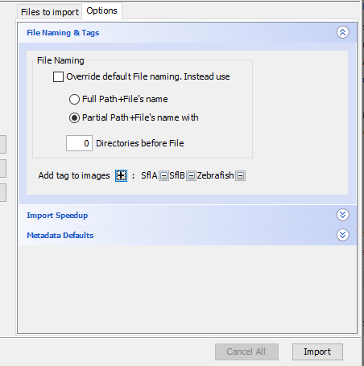

# Downloading and Exporting Data

This section covers how to download and export data from OMERO.

## Web Interface Downloads

### Quick Downloads
Access downloads through the OMERO web interface:

1. Locate your data
2. Click the download button (marked yellow)
   

3. Choose export format:
   
   - Original files
   - OME-TIFF format
   - JPEG format
   - PNG format
   - TIFF format

> ## Browser Timeout Limitation
> Web browser downloads automatically disconnect after 1 minute (60s). For large datasets, use OMERO.insight instead.
<!-- {blockquote:.is-warning} -->

## OMERO.insight Downloads

### Large Dataset Downloads
1. Launch and log into OMERO.insight
2. Navigate to your dataset
3. Click the download button
   

4. Select export format:
   

> Downloads proceed in the background - no progress bar is shown, but the process remains active.
<!-- {blockquote:.is-success} -->

## Export Formats

### Standard Formats
- **Original Format**: Exact copy of uploaded file
- **OME-TIFF**: Standard microscopy format
- **JPEG/PNG**: For presentations/publications
- **TIFF**: For analysis software

### Format Selection
Choose based on intended use:
- Analysis: Original or OME-TIFF
- Presentation: JPEG/PNG
- Archive: Original format

## Batch Downloads

### Dataset Export
1. Select entire dataset
2. Choose export format
3. Select destination folder
4. Wait for background process

### Project Export
- Can export entire projects
- Maintains folder structure
- Includes annotations if selected

## Best Practices

1. **Planning Downloads**
   - Estimate data size
   - Choose appropriate method
   - Verify storage space

2. **Organization**
   - Maintain folder structure
   - Use meaningful names
   - Document downloads

3. **Verification**
   - Check file integrity
   - Verify metadata retention
   - Test sample files

## Tips for Success

1. Use OMERO.insight for large downloads
2. Maintain original file organization
3. Document any format conversions
4. Keep local copies organized

