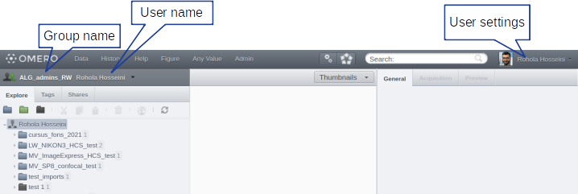
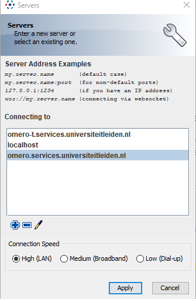

# Getting Started with OMERO

## Registration Process

To access OMERO, you need to be approved in the ULCN system. Please follow these steps:

1. [Fill in the registration form](https://forms.office.com/Pages/ResponsePage.aspx?id=dn8qytfbwE6RCGs9Uk-3yI5fAkzqGzlOrBwKM7sS2VtUOFpGWlM1WkFIQVkySjk4MVE3OVRWMFFBNiQlQCN0PWcu)
2. Wait for approval from an OMERO admin
3. Complete your first login (see below)

### OMERO Administrators

Contact any of the following administrators for registration and OMERO-related questions:
- Joost Willemse (IBL)
- Sylvia Le Dévédec (LACDR)

## First Time Login

> Important: First login must be done within the university network (LAN or WLAN)
<!-- {blockquote:.is-warning} -->

1. Visit [OMERO Web Portal](https://omeroweb.services.universiteitleiden.nl/)
2. Login using your ULCN credentials
3. Logout after successful login
4. Inform your admin that you've completed the first login
5. Wait for confirmation that you've been assigned to the correct group before importing data

After successful login, you'll see your group assignment:

## Remote Access

You can access OMERO from outside the university through several methods:

1. **Remote Desktop Connection**
   - Request access via [Remote Desktop Form](https://helpdesk.universiteitleiden.nl/tas/public/ssp/content/detail/service?unid=706c4daac08c42378d32b7a1fa1582ab&from=bd8e572c-ca86-48d2-bd1b-55886728bdd8)
   - Connect to your university PC

2. **Remote Workplace**
   - Access through [Remote Workplace Portal](https://www.staff.universiteitleiden.nl/ict/working-from-home/remote-workplace/science/institute-of-biology-leiden-ibl?cf=science&cd=institute-of-biology-leiden-ibl)

3. **EduVPN**
   - Set up [EduVPN](https://www.surf.nl/en/getting-started-with-eduvpn) for a secure connection

## OMERO.insight Installation

For uploading data from your computer or downloading large datasets, you'll need OMERO.insight:

1. Download [OMERO.insight](https://www.openmicroscopy.org/omero/downloads/)
2. Request installation:
   - Submit a [software request](https://helpdesk.universiteitleiden.nl/tas/public/ssp/content/serviceflow?unid=12e20347d517424a9c47edd22da4e9cc&from=a06b2d1a-e4da-49b9-ba8a-41117a176176&openedFromService=true), or
   - Request a [semi-managed account](https://helpdesk.universiteitleiden.nl/tas/public/ssp/content/serviceflow?unid=2c19d2f22cde4c509ff4958b173a2fba&from=b62ab85e-2bd2-4b36-9ba7-d85f263ac5db&openedFromService=true)

### Configuring OMERO.insight

1. Start OMERO.insight
2. Click the tool icon
3. Add the Leiden server:
   
   - Press the + sign
   - Enter server address: `omero.services.universiteitleiden.nl`
   
   - Click Apply
4. Login using your ULCN credentials

> After your account is set up, you'll be able to see all data in your assigned group. Contact your OMERO admin if you need access to additional groups.
<!-- {blockquote:.is-info} -->