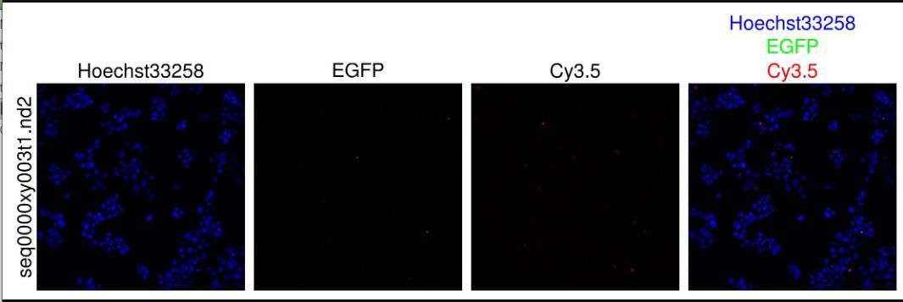

# High-Content Screening Data

This section covers importing and managing high-content screening (HCS) data in OMERO.

## Important Note

>Different file formats and the OMERO system don't always work as expected, especially with plate data and Nikon .nd2 file formats. OMERO may not correctly recognize well mapping if there are empty wells (including edge wells). For correctly importing plate data and screens, it's advised to do this first time with facility staff or during OMERO user meetings.
{.is-warning}

## Creating Plates from Images

### Manual Plate Creation
1. Select the dataset to convert to plate
2. Open the script menu in OMERO webclient
   

3. Select "Dataset to Plate" script
4. Configure plate parameters:
   - IDs: Dataset ID (found in right panel)
   - First axis: Column (A01, A02, A03...) or Row (A01, B01, C01...)
   - Top Row: numeric (A = 1, B = 2, C = 3...)
   - Left column: numeric
   - Last well: column number of last well
   - Column names: number
   - Row names: letter
   - Screen: Optional ID for grouping plates

### Screen Organization
1. Create a screen for multiple related plates:
   
   - Click [create screen] button
   - Useful for organizing replicates
   - Groups related experiments

2. Managing Plates in Screens:
   - Add plates during import
   - Convert datasets to plates
   - Organize multiple replicates

## Importing HCS Data

### Plate Data Types
OMERO supports various HCS data formats from:
- ImageXpress systems
- Nikon HCS
- VAST
- Lionheart
- EVOS systems

### Import Methods

#### Direct Import
For supported formats:
1. Use standard OMERO.insight import
2. Select entire plate folder
3. Maintain folder structure during import

#### Converting Loose Images to Plates
1. Import images as standard dataset
2. Use "Dataset to Plate" script
3. Configure well positions and layout
4. Optionally remove from original dataset

### Metadata Requirements

HCS data should include:
- Plate identifier
- Well positions
- Field information
- Channel data
- Experimental conditions

## Working with Plates

### Viewing and Navigation
1. Use plate viewer for:
   
   - Well-based navigation
   - Thumbnail overviews
   - Individual well details

2. Adjust Display Settings:
   
   - Select well
   - Use preview in right panel
   - Adjust LUT with color picker
   - Set thresholds
   - Use "Save to All" to apply settings across plate

### Building Figures
1. Select wells of interest
2. Click publication options button
3. Choose output type:
   
   - Split View figure (channel views)
   - Thumbnail figure
   - Movie (for live imaging)
4. Download or view in browser

## Best Practices

1. **Data Structure**
   - Maintain original plate layout
   - Keep well metadata intact
   - Document screen parameters

2. **Import Strategy**
   - Test with single plate first
   - Verify data organization
   - Confirm metadata preservation

3. **Quality Control**
   - Check well annotations
   - Verify field positions
   - Validate channel information

>## Storage Considerations
>HCS data can be very large. Plan your import strategy and storage requirements in advance.
{.is-info}

## Additional Resources

- Contact facility staff for large imports
- Check documentation for specific instruments
- Consider automated import scripts for large screens