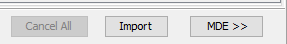

# Metadata Annotations

This section covers how to add and manage metadata annotations in OMERO.

## Setting Up Metadata Support

### Initial Configuration
1. Configure OMERO.insight:
   - Obtain mdeConfiguration.xml from CellObservatory-OMERO SharePoint
   - Save to "Users\$User\OMERO" folder

2. Verify Configuration:
   - Restart OMERO.insight if needed
   - MDE button should appear in import dialog

## Adding Metadata During Import

### Pre-Import Steps
1. Start normal import process in OMERO.insight
2. Select files but **DO NOT** click import yet
3. Click the MDE button next to import
   

### Choosing Metadata Model

Choose the appropriate model:
- **MiBMe** (Minimal Biological Metadata)
  - For standard microscopy experiments
  - Basic experimental parameters
  
- **MiHCSMe** (Minimal High Content Screening Metadata)
  - For high-throughput experiments
  - Includes plate and well information

### Entering Metadata

1. **Manual Entry**
   - Fill in all required fields
   - Add optional information as needed
   - Ensure consistency in terminology

2. **Loading Previous Metadata**
   
   - Use load button to import existing metadata
   - Modify as needed for current experiment

### Example Form

## Managing Metadata

### Saving Templates

> Save commonly used metadata configurations:
> 1. Set up metadata for typical experiments
> 2. Save as template
> 3. Store templates with project documentation
> 4. Share with team members as needed
<!-- {blockquote:.is-success} -->

### Searching with Metadata

- Use search bar in top right
- Filter by metadata fields
- Combine search terms

## Best Practices

1. **Consistency**
   - Use standardized terms
   - Follow naming conventions
   - Maintain consistent units

2. **Documentation**
   - Save metadata templates
   - Document custom fields
   - Share protocols with team

3. **Organization**
   - Group related data
   - Use meaningful annotations
   - Link to experimental protocols

## Advanced Features

### Bulk Annotations
- Apply metadata to multiple images
- Update metadata in batches
- Export metadata for analysis

### Custom Fields
- Add experiment-specific fields
- Define new metadata categories
- Extend standard templates

## Tips for Success

1. Plan metadata structure before import
2. Use templates for routine experiments
3. Verify metadata before final import
4. Keep documentation up to date

> Regular metadata organization makes data more discoverable and analysis more efficient.
<!-- {blockquote:.is-info} -->