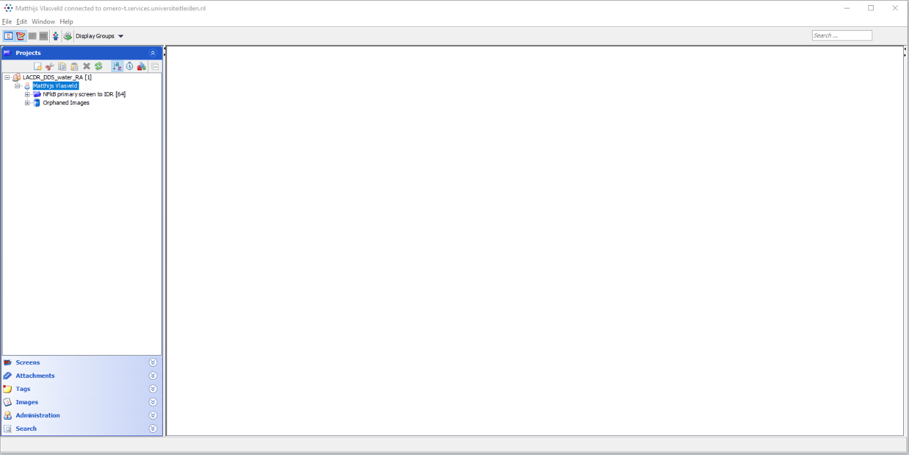
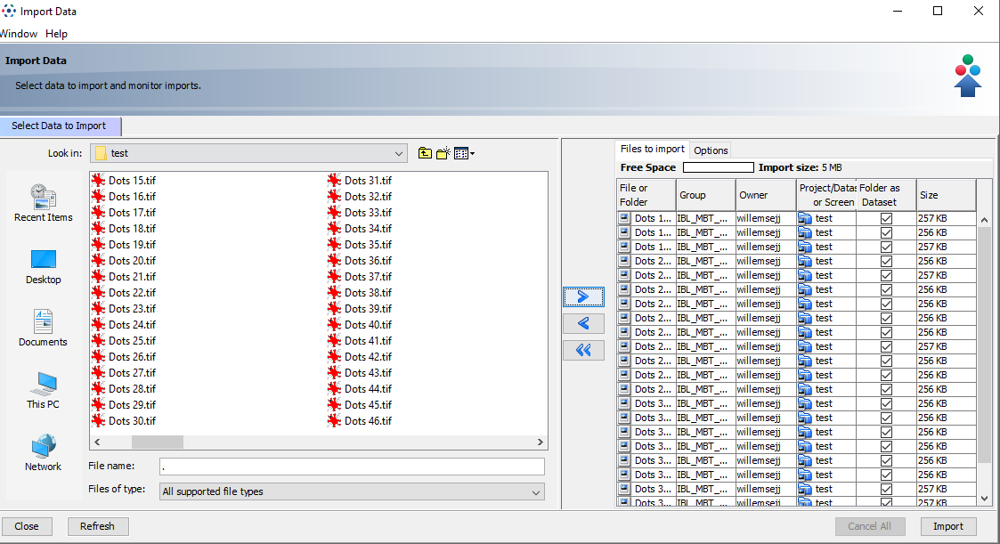
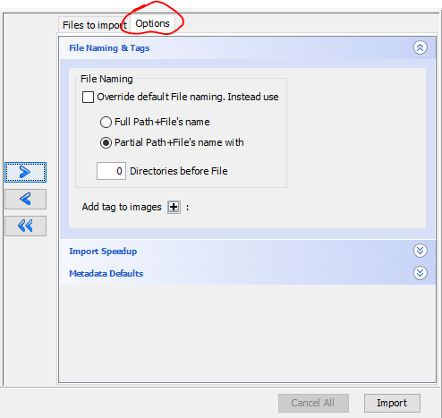
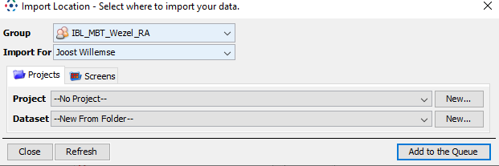
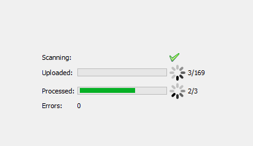

# Microscope-Specific File Types

This section covers importing procedures for different microscope file formats.

## Nikon Files (*.nd2)

### Standard ND2 Files
- Import directly using OMERO.insight
- Use standard import procedure
- Files imported as individual datasets

### Jobs/HCS ND2 Files
For Nikon1 and Nikon2 microscopes with Jobs HCS datasets:

1. Pre-processing Required:
   
   - Open ND2 file on microscope PCs or Nis-elements analysis computer
   - Go to File > Import/Export ND document > Split multipoints
   - Use descriptive prefix and select output folder
   - Click [Split]
   - Each well (and wellsite if multiple sites) gets separate ND2 file

2. After Pre-processing:
   
   - Import using standard procedure
   - Files can be organized into plates
   - Optional conversion to plate format after import

> ## Known BioFormats Issue
> There's a known issue with BioFormats reading .nd2 files that contain Jobs-acquisition of plate data with multi-time in combination with multi-channel.
<!-- {blockquote:.is-warning} -->

## File Organization

When importing:

1. Select files in OMERO.insight
2. Choose project/dataset location
3. Add appropriate tags (recommended)
   

## ImageXpress Data

### Pre-processing Steps
1. Use MetaXpress database (Do NOT save tiffs and thumbs directly on fileserver)
2. Go in the ImageXpress software on the main menu to: 'Screening' -> 'Plate Utilities'
3. Choose 'Export Images'
4. Select the project you want to export
5. Export images from MetaXpress database to a local folder
6. This generates a folder with images, including a **.HTD file** containing:
   - Image metadata
   - Plate information
   - File relationships via filename strings

### Import Process

1. For importing the entire project select only the .HTD
2. OMERO will use the metadata for proper organization
3. Verify plate structure after import

## Additional File Types

## Import Progress

During import, you can monitor progress:

## Best Practices

1. **Pre-import Checks**
   - Verify file format compatibility
   - Prepare any necessary pre-processing
   - Check metadata requirements

2. **Organization**
   - Use clear naming conventions
   - Create logical project/dataset structure
   - Document any special processing steps

3. **Quality Control**
   - Verify data after import
   - Check metadata preservation
   - Validate image organization

> ## Preventing Issues
> If you are not sure about the import of you data ask for help or test a single file before starting a large batch to ensure proper handling of your specific file type.
<!-- {blockquote:.is-info} -->